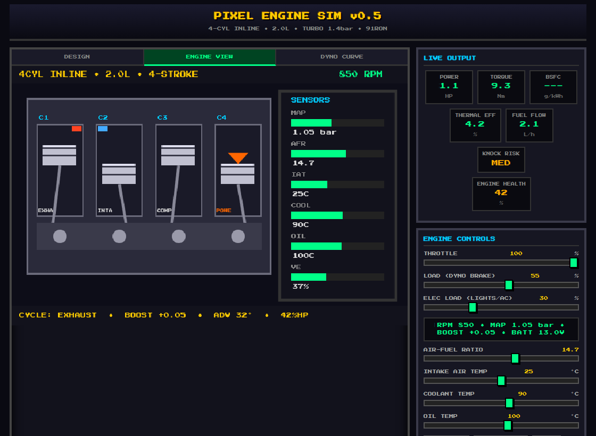
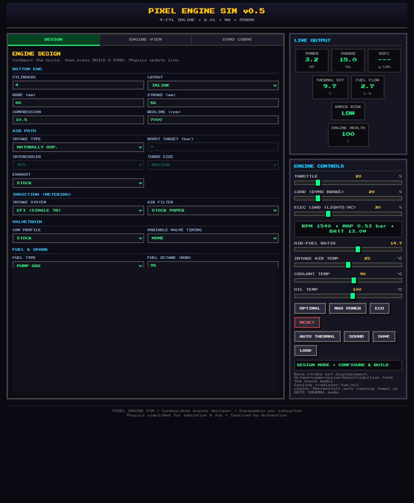
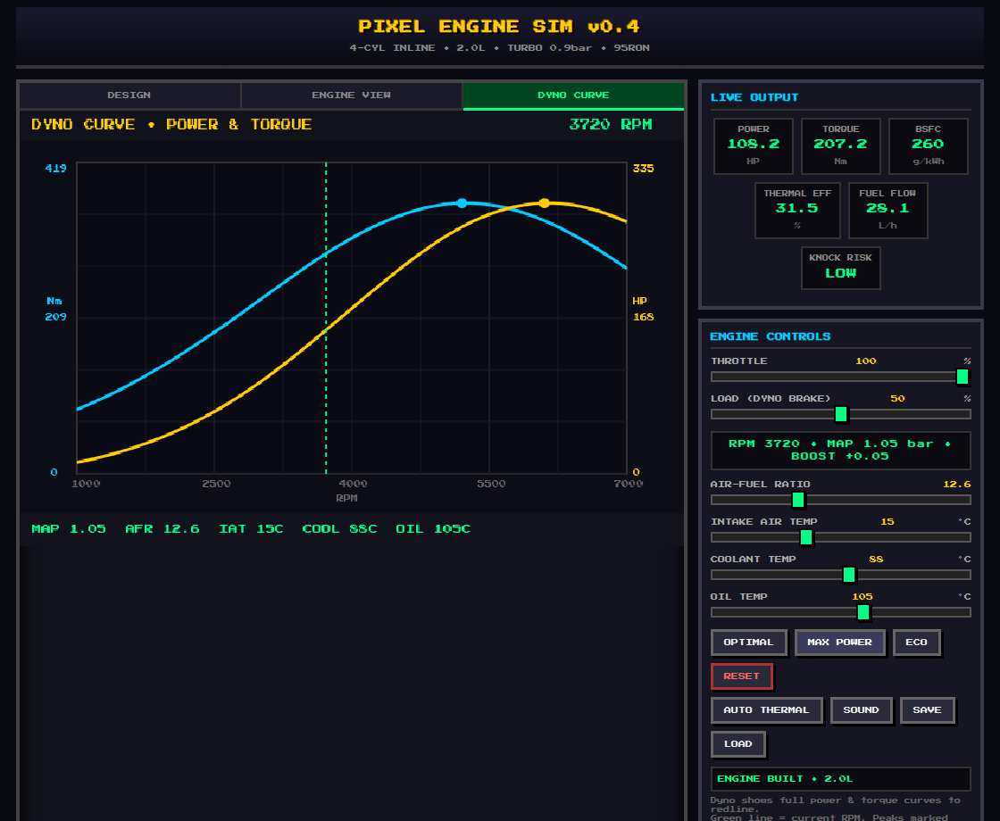

# PIXEL ENGINE SIM v0.5

**A lightweight, 8-bit style internal combustion engine *designer* & simulator** inspired by *Automation*.

Design an engine from the ground up — cylinders, bore & stroke, compression, forced
induction, exhaust, fuel octane, injection and ignition — then run it on the dyno and
watch the physics respond. Web-based, fully offline-capable, installable as a PWA.



## Features

### Engine Designer (new in v0.3)
Configure a build on the **DESIGN** tab, press **BUILD & DYNO**, and every parameter
feeds the physics:

- **Bottom end** — cylinder count (1–12), layout (inline / V / boxer), bore, stroke,
  compression ratio, redline. Bore × stroke × cylinders sets the displacement.
- **Air path** — naturally aspirated / turbo / supercharger, boost target, intercooler,
  turbo size (small / medium / large), and exhaust (stock / sport / race).
- **Induction (metering)** — intake system (1/2/4-bbl carburetor, sidedraft carbs,
  mechanical injection, single-throttle EFI, or individual throttle bodies) and air filter
  (open stacks → restrictive). These set top-end breathing, AFR-metering precision (EFI is
  most efficient; carbs waste fuel), throttle response and idle quality.
- **Valvetrain** — cam profile (stock / sport / race) and variable valve timing (VVT). A
  wilder cam moves the powerband up and adds top-end at the cost of low-end torque and idle
  quality; VVT recovers the bottom end for a broad powerband.
- **Electrical** — alternator size (60 / 120 / 180 A). With a live **ELEC LOAD** control
  (lights/AC), a small alternator plus heavy load at idle drains the battery — low system
  voltage then weakens the spark. Ignition type sets a dwell/misfire RPM limit (a
  distributor falls off up top; coil-on-plug holds to redline).
- **Fuel & spark** — fuel type (pump gas / race gas / E85 / methanol), fuel octane (RON,
  pump gas only), injector type (port / direct), ignition type (distributor / wasted spark /
  coil-on-plug), and **ignition control**: *Fixed* (a locked advance you dial in) or *Auto*
  (an ECU that tracks MBT timing and retards just enough to stay off knock). Each fuel has
  its own energy density, stoich AFR, knock rating and charge-cooling — alcohols resist
  knock and cool the charge (more power headroom) but burn far more fuel.
- **Cooling** — radiator size (small / stock / large), cooling fan (none / mechanical /
  electric), oil cooler, and thermostat opening temperature.
- **Reliability / wear** — the engine has a live **health** that falls under abuse:
  sustained detonation, overheating, lean-under-boost, and over-rev all wear it (a clean
  tune barely ages). A worn engine makes less power; at zero health it lets go and must be
  rebuilt (BUILD & DYNO or RESET). This puts real stakes on every design and tune choice.

These couple realistically: octane, compression, boost, intake temperature and ignition
advance all feed a **knock model**, and direct injection / higher octane buy back knock
margin so you can run more boost or timing. Get it wrong and the ECU derates power. The
**cooling subsystem** sets running temperatures in Auto Thermal mode — an under-sized
radiator with no fan will heat-soak and overheat under load (and at idle), which in turn
saps power; a large radiator, electric fan and oil cooler keep it cool.



### Simulation & live tuning
- **Live outputs**: Power (HP), Torque (Nm), BMEP, Volumetric Efficiency, Thermal
  Efficiency, BSFC, Fuel Flow, Knock Risk, Engine Health.
- **Animated cutaway** that renders your actual cylinder count through the full 4-stroke
  cycle (Intake → Compression → Power → Exhaust).
- **Dyno Curve** — full power & torque vs RPM out to your redline, with peak markers and a
  live current-RPM line.
- **Drive it (dynamic model)** — you control **THROTTLE** and **LOAD** (a dyno brake), not
  RPM directly. Opening the throttle raises manifold pressure (MAP), which makes torque,
  which spins the engine up through its **rotating inertia** (derived from displacement &
  stroke, so a big long-stroke engine revs lazily and a small one snaps up). A turbo
  spools as the revs climb; closed throttle gives engine braking; there's an idle floor
  and a rev limiter. No load + throttle = revs to the limiter; add load to hold an RPM.
- **Other runtime controls**: AFR, intake-air / coolant / oil temps.
- **Auto Thermal mode** — coolant & oil drift toward load-dependent targets over time,
  balanced against the cooling subsystem's capacity (radiator airflow scales with RPM;
  the fan provides idle cooling).
- **Engine sound** — Web Audio note pitched to firing frequency (scales with cylinder
  count & RPM) and load.
- **Save / Load** — stores and recalls the entire build + tune via `localStorage`.
- **Presets**: Optimal / Max Power / Eco / Reset (adapt to the current engine).
- **Installable PWA**, self-hosted font, works fully offline.



## How to Run

### Local
Serve the folder over HTTP and open `index.html`:
```bash
python3 -m http.server 8000    # then visit http://localhost:8000
```
> Opening via `file://` works too, but the PWA/offline features only activate over `http(s)`.

### GitHub Pages
This repo ships `.github/workflows/pages.yml`. Push to `main`, set **Settings → Pages →
Source: GitHub Actions**, and it deploys to
`https://<your-username>.github.io/<repo-name>/`.

## Runtime Controls

| Control          | Range         | Notes |
|------------------|---------------|-------|
| Throttle         | 0 – 100 %     | Opens the flap → MAP → torque → revs |
| Load (dyno brake)| 0 – 100 %     | Resistance that sets steady RPM; 0 = free-rev to limiter |
| Elec load        | 0 – 100 %     | Accessory electrical draw (lights/AC); can drain the battery at idle |
| Air-Fuel Ratio   | rescales/fuel | ~λ0.86 peak power, ~λ1.05 peak efficiency (range set by fuel) |
| Intake Air Temp  | -10 – 60 °C   | Colder = denser charge = more power |
| Coolant Temp     | 40 – 130 °C   | Optimal ~90 °C (auto in Auto Thermal) |
| Oil Temp         | 40 – 150 °C   | Optimal ~100 °C (auto in Auto Thermal) |

RPM and MAP are now **outputs** (shown live under the sliders), not inputs. The **Dyno
Curve** tab remains a wide-open-throttle steady-state sweep for reading the full curve.

## Physics Notes (simplified educational model)

- Displacement derived from bore, stroke and cylinder count.
- Dynamic driveline: manifold pressure fills toward a throttle/RPM/boost target; net torque
  (combustion − pumping − friction − load) accelerates the crank through a rotating inertia
  derived from displacement and stroke. Pumping loss under vacuum gives engine braking; a
  rev limiter cuts fuel at redline; an idle floor prevents stalling.
- VE uses a broad generalized-bell breathing curve (flat plateau, gentle shoulders) so
  torque stays flat across the midrange and power keeps climbing toward redline instead of
  falling off a peaky Gaussian. Its peak shifts with bore/stroke ratio and redline; exhaust
  choice trades low-end for top-end scavenging.
- Camshaft profile shifts the VE peak and adds top-end breathing/scavenging at the cost of
  low-end VE and idle quality (a wild cam idles high and lumpy). VVT restores most of the
  low end, widening the powerband — strong bottom *and* top.
- Output is calibrated to sane ballpark figures (e.g. a 2.0 L turbo at 0.8 bar / sport
  exhaust / 98 RON makes ~255 hp & ~350 Nm; a 2.0 NA ~130 hp), with only a gentle power
  drop from peak to redline.
- Compression scales indicated work and efficiency via a relative Otto-cycle factor.
- Forced induction raises achievable MAP; without an intercooler the charge heats up.
  Superchargers cost parasitic drive power.
- Turbo boost spools with RPM along a logistic curve: small turbos spool early (strong
  midrange) but choke the top end, large turbos lag down low but flow more up top. Actual
  boost also lags in time (turbo lag), so it builds over ~1 s in the live Engine View.
- Ignition timing has a max-brake-torque (MBT) optimum that varies with RPM and load — too
  little or too much advance loses power, and advancing past MBT feeds knock (retarding pulls
  it back). *Fixed* timing is only optimal at one operating point; *Auto* tracks MBT
  everywhere and retards under knock, so it makes more power across the curve and adapts to
  fuel — full timing on race gas/E85, pulled timing on low octane or high boost.
- Intake system sets top-end airflow (restrictive small carbs choke up top; ITBs, sidedraft
  carbs and mechanical injection breathe best) and AFR-metering precision — EFI holds optimal
  AFR for the best efficiency, while carburetors and mechanical injection run richer and
  waste fuel (worse BSFC). The air filter adds an airflow-weighted restriction.
- Knock combines boost, compression, charge/coolant temperature, RPM, timing and mixture,
  offset by fuel octane, charge cooling and direct injection; high knock derates power.
- Fuel type sets energy density, stoichiometric AFR (the mixture control works in lambda,
  so the AFR slider rescales per fuel), knock rating and evaporative charge cooling. E85 and
  methanol resist knock and cool the intake charge (more power) but need much more fuel
  flow (higher BSFC), while race gas is high-octane pump gas.
- Cooling balances load-generated heat against radiator capacity + airflow (RPM-driven)
  and fan; the thermostat sets the floor temperature. Overheating (>~108 °C) costs power.
- Reliability: engine health accumulates wear from detonation (the big killer), overheat,
  lean-under-boost (burnt pistons) and over-rev; a clean tune barely wears. Lower health
  cuts power; zero health = catastrophic failure until rebuilt. Damage happens over tens of
  seconds of abuse — long enough to heed the warnings and back off.
- Electrical: the alternator (output rising with RPM) charges the battery when it
  out-supplies demand and drains it otherwise; system voltage tracks state of charge. Low
  voltage weakens the spark, and each ignition type has a dwell/misfire RPM limit, so a
  distributor or a flat battery loses top-end power. The alternator also costs a little
  parasitic crank power, most noticeable at idle.
- Standard 4-stroke BMEP → Torque → Power conversion throughout.

Numbers are calibrated to a realistic ballpark but this is not a high-fidelity thermodynamic
model — it's tuned for fun, learning and rapid experimentation (the "light Automation"
philosophy).

## Project Structure

```
.
├── index.html                     # Complete single-file app (HTML + CSS + JS)
├── favicon.svg / manifest.webmanifest / sw.js   # PWA (icon, manifest, offline SW)
├── assets/                        # Self-hosted font + PWA icons
├── docs/                          # README screenshots
└── .github/workflows/pages.yml    # Auto-deploy to GitHub Pages
```

## Roadmap / Future Expansion

- [x] Configurable engine designer (cylinders, bore/stroke, compression, induction, fuel, spark)
- [x] Dynamic throttle + load driveline with rotating inertia (drive it, don't set RPM)
- [x] Full dyno sweep graphs (power & torque curves)
- [x] Dynamic thermal model (temps change over time)
- [x] Forced induction (turbo / supercharger, boost, intercooler)
- [x] Sound (Web Audio API engine note)
- [x] Save / load engine setups
- [x] Mobile app packaging (PWA)
- [ ] Proper V / boxer bank visuals & firing-order animation
- [x] Cam profiles & valvetrain (stock/sport/race cam + VVT, reshaping the VE curve & idle)
- [x] Turbo lag / spool modelling vs. RPM (turbo size, spool curve, transient lag)
- [x] Cooling subsystem (radiator size, fan, oil cooler, thermostat) feeding the thermal model
- [x] Electrical subsystem (alternator, battery/charging, dwell-limited ignition misfire)
- [x] Different fuels (pump/race gas, E85, methanol) with their own energy, stoich, knock & cooling
- [x] Induction/metering systems (carbs, mechanical injection, EFI, ITBs) + air filters
- [x] Ignition control: Fixed vs Auto (ECU, MBT-tracking & knock-limited timing)
- [x] Reliability / wear simulation (health falls under detonation/overheat/lean-boost/over-rev)
- [x] Calibration pass for realistic power figures & curve shape (ongoing refinement)
- [ ] Native Android build (wrap the PWA with Capacitor or a Trusted Web Activity)

> **Android note:** the app is intentionally a self-contained, offline-capable PWA with no
> server or external network dependencies and all persistence in `localStorage`. That keeps
> it wrappable into an Android APK later (Capacitor or a Trusted Web Activity) with minimal
> changes. New features are kept touch-friendly and framework-free to preserve that path.

## License

MIT – free to use, modify, and share. Credit appreciated but not required. See [LICENSE](LICENSE).

---

**PIXEL ENGINE SIM** – Built for tinkerers who love engines and pixel art.
