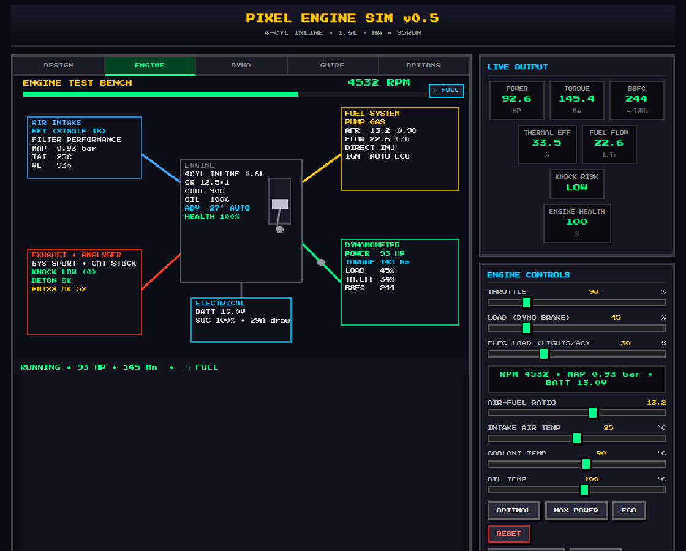
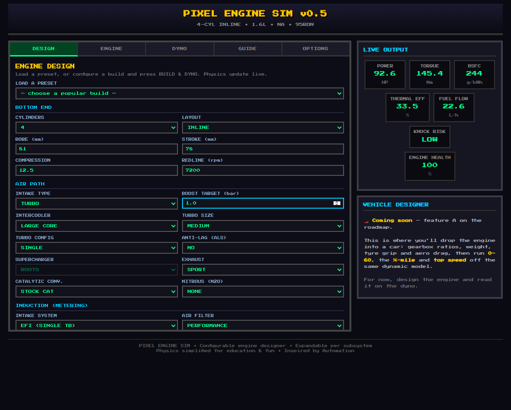
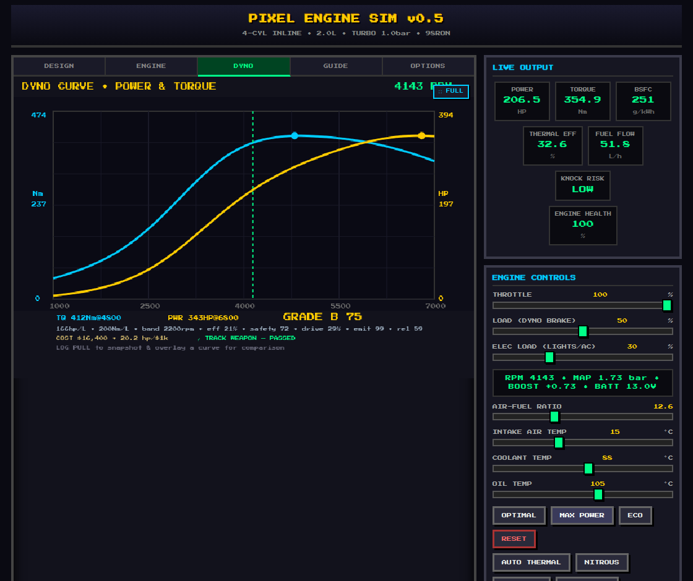
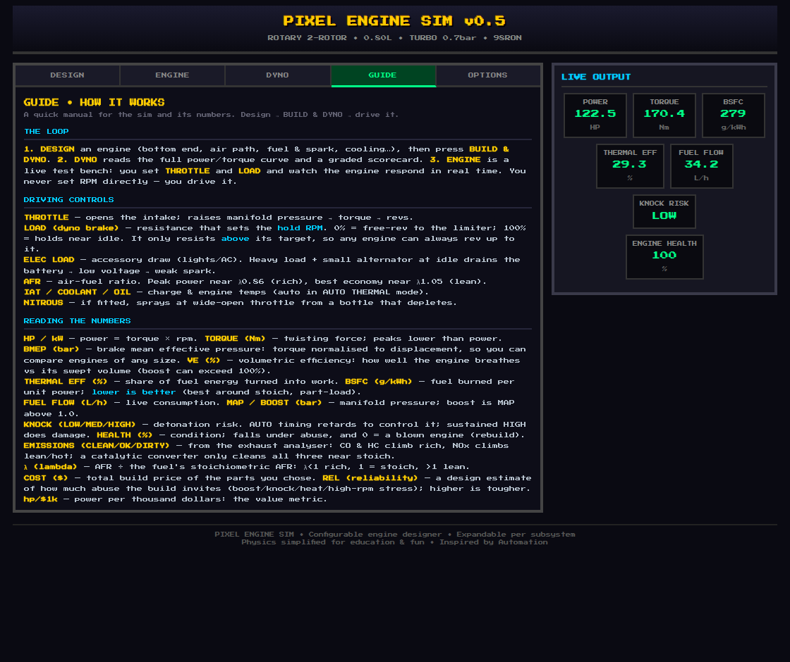
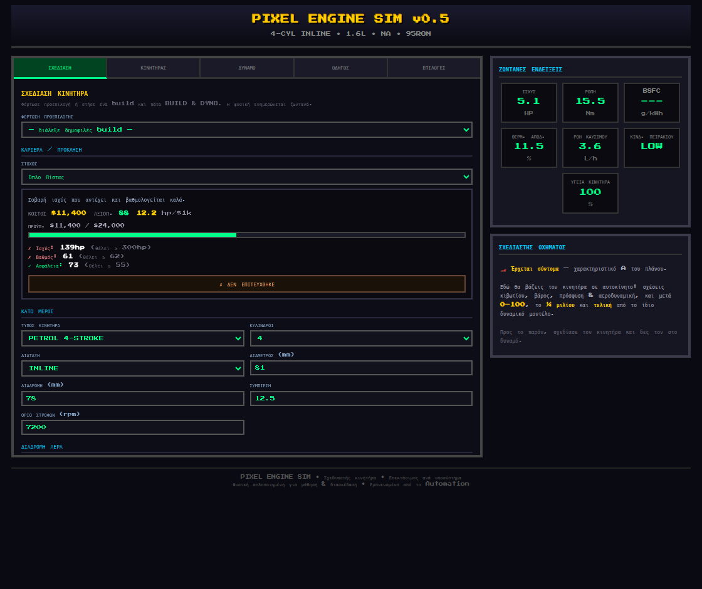
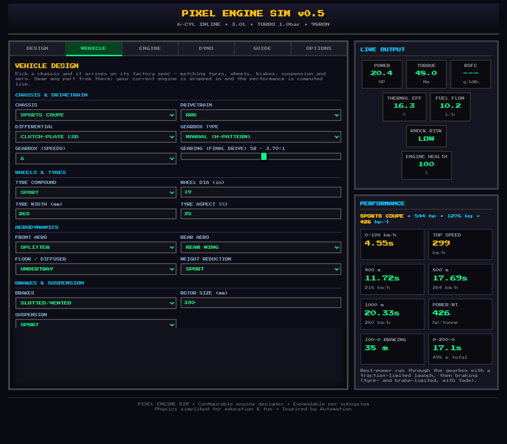

# PIXEL ENGINE SIM v0.5

**A lightweight, 8-bit style internal combustion engine *designer* & simulator** inspired by *Automation*.

Design an engine from the ground up — cylinders, bore & stroke, compression, forced
induction, exhaust, fuel octane, injection and ignition — then run it on the dyno and
watch the physics respond. Web-based, fully offline-capable, installable as a PWA.



## Features

### Engine Designer (new in v0.3)
Load one of **16 preset builds** from the dropdown — petrol, diesel, rotary and 2-stroke
(1.6 sport, kei turbo, hot-hatch, ITB
screamer, 2JZ six, muscle V8, blown V8, V12 supercar…), or configure your own on the
**DESIGN** tab and press **BUILD & DYNO**. Every parameter feeds the physics:

- **Engine type / cycle** — **petrol 4-stroke**, **diesel (compression-ignition)**,
  **2-stroke**, or **rotary (Wankel)**. Each reshapes the physics: a power stroke every rev
  (2-stroke & rotary) doubles the firing frequency for high specific output; diesel runs lean
  and unthrottled with no spark-knock, big low-end torque and the best efficiency; 2-stroke
  and rotary are thirsty and HC-heavy; rotaries rev sky-high and turbine-smooth. Switching type
  retargets the compression / redline / AFR ranges and disables what doesn't apply.
- **Bottom end** — cylinder count (1–12; rotors 1–3 for rotary), layout (inline / V / boxer),
  bore, stroke, compression ratio, redline. Bore × stroke × cylinders sets the displacement.
- **Air path** — naturally aspirated / turbo / supercharger, boost target, **intercooler size**
  (none / small / large core — a bigger core cools the charge more but adds a little spool lag),
  turbo size, **turbo configuration** (single / twin / sequential / compound), **anti-lag**,
  **supercharger type** (roots / twin-screw / centrifugal), **nitrous** (small / big shot),
  exhaust (stock / sport / race) and a **catalytic converter** (none/decat / sport / stock).
  Twin/sequential/compound turbos spool earlier and flatter; PD superchargers make boost from
  idle while centrifugals build it with rpm²; anti-lag keeps the turbo lit (at a wear cost);
  nitrous is a big power adder from a bottle. A cat cleans the exhaust but adds a little
  back-pressure; deleting it frees a few hp at the cost of emissions.
- **Induction (metering)** — intake system (1/2/4-bbl carburetor, sidedraft carbs,
  mechanical injection, single-throttle EFI, or individual throttle bodies) and air filter
  (open stacks → restrictive). These set top-end breathing, AFR-metering precision (EFI is
  most efficient; carbs waste fuel), throttle response and idle quality.
- **Valvetrain** — cam profile (stock / sport / race) and variable valve timing (VVT). A
  wilder cam moves the powerband up and adds top-end at the cost of low-end torque and idle
  quality; VVT recovers the bottom end for a broad powerband.
- **Electrical** — alternator size (60 / 120 / 180 A). With a live **ELEC LOAD** control
  (lights/AC), a small alternator plus heavy load at idle drains the battery — low system
  voltage then weakens the spark. Ignition type sets a dwell/misfire RPM limit (a
  distributor falls off up top; coil-on-plug holds to redline).
- **Fuel & spark** — fuel type (pump gas / race gas / E85 / methanol), fuel octane (RON,
  pump gas only), injector type (port / direct), ignition type (distributor / wasted spark /
  coil-on-plug), **ignition control** (*Fixed* — a locked advance you dial in — or *Auto*, an
  ECU that tracks MBT timing and retards just enough to stay off knock), and the **fuel mixture**:
  *Manual* (one AFR you set everywhere) or *Auto*, a **3D ECU fuel map** that targets near-stoich
  at light load and enriches under load & boost for power/EGT — just like a real fuel map (the
  default on fuel-injected builds; a live **load×RPM heat-grid** shows the target AFR in every
  cell with a marker on the current operating point, and the map is **editable** — tap a cell and
  nudge it richer/leaner to hand-tune the mixture, or reset to the factory grid). Carbs/mechanical
  injection stay manual. Each
  fuel has its own energy density, stoich AFR, knock rating and charge-cooling — alcohols resist
  knock and cool the charge (more power headroom) but burn far more fuel.
- **Cooling** — radiator size (small / stock / large), cooling fan (none / mechanical /
  electric), oil cooler, and thermostat opening temperature.
- **Reliability / wear** — the engine has a live **health** that falls under abuse:
  sustained detonation, overheating, lean-under-boost, and over-rev all wear it (a clean
  tune barely ages). A worn engine makes less power; at zero health it lets go and must be
  rebuilt (BUILD & DYNO or RESET). This puts real stakes on every design and tune choice.

These couple realistically: octane, compression, boost, intake temperature and ignition
advance all feed a **knock model**, and direct injection / higher octane buy back knock
margin so you can run more boost or timing. Get it wrong and the ECU derates power. The
**cooling subsystem** sets running temperatures in Auto Thermal mode — an under-sized
radiator with no fan will heat-soak and overheat under load (and at idle), which in turn
saps power; a large radiator, electric fan and oil cooler keep it cool.



### Simulation & live tuning
- **Live outputs**: Power (HP), Torque (Nm), BMEP, Volumetric Efficiency, Thermal
  Efficiency, BSFC, Fuel Flow, Knock Risk, Engine Health.
- **Six tabs** — **DESIGN** (build the engine), **VEHICLE** (drop it in a car & read its
  performance), **ENGINE** (live test-bench schematic), **DYNO** (power/torque curve +
  scorecard), **GUIDE** (an in-app manual) and **OPTIONS** (sound, wear and **language**). The
  right column is context-aware: runtime Engine Controls while driving/on the dyno, and the
  live **Performance** panel on the VEHICLE tab.
- **Vehicle & performance (new)** — pick a **chassis** (13 archetypes, each with its own weight,
  size, drivetrain and grip) and it arrives on its **factory spec**: the tyres, wheels, brakes,
  suspension, aero and gearbox that car would really wear, so a kei car turns up on skinny eco
  tyres and small steel discs while a hypercar gets wide semi-slicks, carbon-ceramics and a
  wing/diffuser package. Every part stays editable from there, and **REFIT FACTORY SPEC** puts it
  all back; the summary marks the car *(factory spec)* or *(modified)*. Tune the
  **drivetrain** (FWD/RWD/AWD), the **gearbox** — **type** (manual / sequential / DCT /
  torque-converter auto, each with its own shift time, driveline loss and ratio spacing; the auto
  adds converter stall & torque multiplication off the line), 4–8 speeds, and a
  **final-drive slider**, 4.90:1 short → 2.60:1 tall, with the ratio shown next to the number —
  **tyres** (compound + width/profile/wheel diameter → grip &
  rolling radius), **aero** (front/rear/floor downforce vs drag), **brakes** (type + rotor size →
  stopping power & fade resistance), **suspension** (a grip multiplier) and **weight reduction**.
  Your current engine is dropped in and the sim computes **0–100 km/h**, **400 / 800 / 1000 m**
  (time + trap speed), **top speed**, **100–0 braking** and the **0–200–0** test live — a
  traction-limited launch and a tyre/brake-limited stop (with fade), weight transfer, downforce,
  aero drag and rolling resistance. Vehicle cost and power-to-weight are shown too.
- **Engine-view schematic** — a test-bench diagram (air intake, fuel system, engine,
  exhaust/analyser, dynamometer, electrical) with live values on every subsystem, instead of
  a too-fast animation. The **exhaust/analyser** box reads live **emissions** (a CLEAN/OK/DIRTY
  rating, with CO/HC/NOx in the detailed view) like the bench gas analyser it's modelled on. A
  **⛶ FULL** button opens a full-screen detailed view with extra readouts.
- **In-app GUIDE** — a built-in manual (kept in-app so the offline PWA stays self-contained)
  that explains the loop, the driving controls, every metric on screen and each design
  subsystem, so the numbers are never a mystery.
- **Emissions** — engine-out CO / HC / NOx computed from the mixture (λ) and combustion
  temperature, then cleaned by the catalytic converter *only* in a narrow window around
  stoich: run rich and CO/HC spike (no O₂ to burn them); run lean and NOx slips past (a cat
  can't reduce it with excess O₂). A **DIRTY** analyser is the price of chasing power on a rich
  or decatted tune.
- **WEAR toggle** — turn damage/wear off for free experimentation (invincible engine) or on
  for consequences.
- **Dyno Curve** — full power & torque vs RPM out to your redline, with peak markers and a
  live current-RPM line.
- **Drive it (dynamic model)** — you control **THROTTLE** and **LOAD** (a dyno brake), not
  RPM directly. Opening the throttle raises manifold pressure (MAP), which makes torque,
  which spins the engine up through its **rotating inertia** (derived from displacement &
  stroke, so a big long-stroke engine revs lazily and a small one snaps up). A turbo
  spools as the revs climb; closed throttle gives engine braking; there's an idle floor
  and a rev limiter. No load + throttle = revs to the limiter; add load to hold an RPM.
- **Other runtime controls**: AFR, intake-air / coolant / oil temps.
- **Auto Thermal mode** — coolant & oil drift toward load-dependent targets over time,
  balanced against the cooling subsystem's capacity (radiator airflow scales with RPM;
  the fan provides idle cooling).
- **Engine sound** — Web Audio note pitched to firing frequency (scales with cylinder
  count & RPM) and load, now with a **lope/burble** whose depth tracks the build's character —
  a wild cam, a cross-plane V8 or anti-lag idles lumpy, while VVT and more cylinders smooth
  it out.
- **Scoring** — every build gets a graded scorecard (S–F) rating power, specific output,
  powerband width, efficiency, knock safety, drivability and **emissions**, shown on the
  design summary and the dyno.
- **Strategy / Career** — every build has a **parts cost** and a **reliability index** (a
  design estimate of how much abuse it invites), plus a **power-per-dollar** metric. Pick an
  **OBJECTIVE** on the DESIGN tab (Budget Sleeper, Power per Dollar, Eco Cruiser, Track
  Weapon, Reliability Run, Clean Machine, Specific-Output King…) — some cap your budget — and
  the challenge card ticks off each target live (✓/✗) with a PASS/FAIL verdict, mirrored on
  the dyno. Turns free design into a puzzle with real trade-offs.
- **Dyno pull logging** — snapshot the current curve and overlay several pulls on the graph
  to compare builds or tunes.
- **Save / Load / Share** — quick-save to `localStorage`; **save to a named file** (with a
  note) and **open** one back; or **Share** a build as an encoded link (copied to the
  clipboard) that loads the exact engine when opened.
- **Presets**: Optimal / Max Power / Eco / Reset (adapt to the current engine).
- **Languages** — English and **Ελληνικά (Greek)**, switchable in OPTIONS and remembered
  between visits. The whole interface — tabs, labels, buttons, the challenge card and the full
  in-app GUIDE — localises (live technical readouts and units stay universal).
- **Responsive** — a fluid layout that fills the screen in **portrait** (phones & tablets held
  upright) as well as landscape, scaling type and controls up so nothing sits in a narrow strip.
- **Installable PWA**, self-hosted font, works fully offline.



The built-in **GUIDE** tab explains every control and metric without leaving the app:



The interface is fully translatable (English / Ελληνικά) and fills the screen in portrait:



The **VEHICLE** tab drops your engine into a car and computes acceleration & top speed:



## How to Run

### Local
Serve the folder over HTTP and open `index.html`:
```bash
python3 -m http.server 8000    # then visit http://localhost:8000
```
> Opening via `file://` works too, but the PWA/offline features only activate over `http(s)`.

### GitHub Pages
This repo ships `.github/workflows/pages.yml`. Push to `main`, set **Settings → Pages →
Source: GitHub Actions**, and it deploys to
`https://<your-username>.github.io/<repo-name>/`.

## Runtime Controls

| Control          | Range         | Notes |
|------------------|---------------|-------|
| Throttle         | 0 – 100 %     | Opens the flap → MAP → torque → revs |
| Load (dyno brake)| 0 – 100 %     | Resistance that sets steady RPM; 0 = free-rev to limiter |
| Elec load        | 0 – 100 %     | Accessory electrical draw (lights/AC); can drain the battery at idle |
| Air-Fuel Ratio   | rescales/fuel | ~λ0.86 peak power, ~λ1.05 peak efficiency (range set by fuel) |
| Intake Air Temp  | -10 – 60 °C   | Colder = denser charge = more power |
| Coolant Temp     | 40 – 130 °C   | Optimal ~90 °C (auto in Auto Thermal) |
| Oil Temp         | 40 – 150 °C   | Optimal ~100 °C (auto in Auto Thermal) |

RPM and MAP are now **outputs** (shown live under the sliders), not inputs. The **Dyno
Curve** tab remains a wide-open-throttle steady-state sweep for reading the full curve.

## Physics Notes (simplified educational model)

- Engine cycle: the torque equation uses a power-stroke divisor per type — 4π for 4-stroke
  (one power stroke every two revs) and 2π for a 2-stroke and a rotary (a power event every
  rev), which is the main reason those make high specific output. Diesel is compression
  ignition (no spark, no spark-knock; limited by smoke/EGT), runs lean and unthrottled (little
  pumping loss), makes big low-end torque and the highest thermal efficiency; 2-stroke and
  rotary carry a thirst penalty (scavenging / seal losses) and rev high. Emissions follow the
  cycle too (diesel = NOx + soot with DPF/SCR aftertreatment; 2-stroke & rotary = high HC).
- Displacement derived from bore, stroke and cylinder count.
- Dynamic driveline: manifold pressure fills toward a throttle/RPM/boost target; net torque
  (combustion − pumping − friction − brake) accelerates the crank through a rotating inertia
  derived from displacement and stroke. LOAD is a dyno brake that targets a hold-RPM and only
  resists above it (so even a peaky engine can always rev up to it, rather than getting
  trapped below a torque valley); zero load free-revs to the limiter. Lifting the throttle
  gives engine braking, and injection systems cut fuel on overrun (DFCO — zero fuel flow); a
  rev limiter cuts fuel at redline; an idle floor prevents stalling.
- VE uses a broad generalized-bell breathing curve (flat plateau, gentle shoulders) so
  torque stays flat across the midrange and power keeps climbing toward redline instead of
  falling off a peaky Gaussian. Its peak shifts with bore/stroke ratio and redline; exhaust
  choice trades low-end for top-end scavenging.
- Camshaft profile shifts the VE peak and adds top-end breathing/scavenging at the cost of
  low-end VE and idle quality (a wild cam idles high and lumpy). VVT restores most of the
  low end, widening the powerband — strong bottom *and* top.
- Output is calibrated to sane ballpark figures (e.g. a 2.0 L turbo at 0.8 bar / sport
  exhaust / 98 RON makes ~255 hp & ~350 Nm; a 2.0 NA ~130 hp), with only a gentle power
  drop from peak to redline.
- Compression scales indicated work and efficiency via a relative Otto-cycle factor.
- Forced induction raises achievable MAP and heats the charge; the intercooler size sets how
  much of that heat is removed (a large core leaves the charge coolest — denser air, more knock
  margin — but its extra plumbing volume adds a little turbo spool lag). Superchargers cost
  parasitic drive power.
- Turbo boost spools with RPM along a logistic curve: small turbos spool early (strong
  midrange) but choke the top end, large turbos lag down low but flow more up top. Actual
  boost also lags in time (turbo lag), so it builds over ~1 s in the live Engine View.
- Ignition timing has a max-brake-torque (MBT) optimum that varies with RPM and load — too
  little or too much advance loses power, and advancing past MBT feeds knock (retarding pulls
  it back). *Fixed* timing is only optimal at one operating point; *Auto* tracks MBT
  everywhere and retards under knock, so it makes more power across the curve and adapts to
  fuel — full timing on race gas/E85, pulled timing on low octane or high boost.
- Fuel mixture: in *Manual* mode the AFR you set is used everywhere; in *Auto* mode a 3D ECU
  fuel map picks the target AFR from load (MAP) and RPM — near stoich at light load for economy,
  richer under load and boost (down to ~λ0.80) for power and exhaust-temperature control, like a
  real fuel map. Fuel *quantity* is always the air mass ÷ target AFR (so it already responds to
  both load and RPM); the map adds the load-varying target on top. The map is **hand-editable**
  in the design panel — select any load×RPM cell and shift its target richer/leaner (the live dyno
  reflects the change immediately); a custom map is saved with the build and can be reset to the
  factory grid at any time. Scoring and the vehicle acceleration model always evaluate at a fixed
  best-power AFR, so grades and lap-style figures stay comparable regardless of the mode or any
  hand-tuning.
- Intake system sets top-end airflow (restrictive small carbs choke up top; ITBs, sidedraft
  carbs and mechanical injection breathe best) and AFR-metering precision — EFI holds optimal
  AFR for the best efficiency, while carburetors and mechanical injection run richer and
  waste fuel (worse BSFC). The air filter adds an airflow-weighted restriction.
- Knock combines boost, compression, charge/coolant temperature, RPM, timing and mixture,
  offset by fuel octane, charge cooling and direct injection; high knock derates power.
- Emissions: CO rises sharply when rich (incomplete combustion); HC is U-shaped — high rich
  (excess fuel) and very lean (misfire), plus cam-overlap scavenging, imprecise metering and
  a cold engine; NOx is thermal, peaking slightly lean (~λ1.08) and scaling with combustion
  temperature (load, compression, spark advance, hot charge). A three-way cat needs excess O₂
  to oxidise CO/HC but an O₂-free exhaust to reduce NOx, so only a stoich mixture cleans all
  three at once — the rating rewards a cat + precise stoich metering and punishes rich/lean/
  decatted running. The cat also adds a little exhaust back-pressure (a small top-end VE loss).
- Fuel type sets energy density, stoichiometric AFR (the mixture control works in lambda,
  so the AFR slider rescales per fuel), knock rating and evaporative charge cooling. E85 and
  methanol resist knock and cool the intake charge (more power) but need much more fuel
  flow (higher BSFC), while race gas is high-octane pump gas.
- Cooling balances load-generated heat against radiator capacity + airflow (RPM-driven)
  and fan; the thermostat sets the floor temperature. Overheating (>~108 °C) costs power.
- Reliability: engine health accumulates wear from detonation (the big killer), overheat,
  lean-under-boost (burnt pistons) and over-rev; a clean tune barely wears. Lower health
  cuts power; zero health = catastrophic failure until rebuilt. Damage happens over tens of
  seconds of abuse — long enough to heed the warnings and back off.
- Vehicle: acceleration is integrated step-by-step — the engine's best-power torque curve is
  taken through the gearbox (auto-spaced ratios × a final drive from the gearing slider), giving
  tractive force = wheel torque ÷ rolling radius, capped by traction (μ × the driven-axle load,
  including static weight distribution, longitudinal weight transfer under acceleration, and
  aero downforce). Aero drag (½ρ·CdA·v²) and rolling resistance oppose it; the car shifts at the
  limiter, losing drive for the gearbox's shift time. The launch depends on the gearbox. A clutch
  box (manual/sequential/DCT) models a **slipping clutch**: from a standstill the engine is held
  at its launch rpm (≈55 % of the redline) while road speed brings the gearbox input up to meet
  it, and only then locks to the wheels — which is why a peaky, high-revving engine can still
  leave the line hard instead of falling into a torque hole the instant it moves. Slipping never
  adds torque; drive force is still capped by traction, so the launch stays grip-limited. A
  **torque-converter auto** instead stalls its impeller up against a slow turbine and *multiplies*
  engine torque (≈1.9× at a 2400 rpm stall), fading to 1:1 as the turbine catches up. That launch
  advantage is why an auto beats an equivalent manual on a heavy, torquey engine (6.6 diesel
  pickup, 8.61 s → 8.01 s) and loses badly on a light, peaky one whose powerband sits far above
  the stall speed (2.0 ITB screamer roadster, 4.55 s → 5.96 s) — at the cost of the worst
  driveline efficiency of the four boxes.
  Top speed is the fastest steady speed **any** gear can hold (thrust = drag + rolling
  resistance, capped by the limiter) — a peaky or over-geared car genuinely reaches its maximum
  one gear down, on the cam, rather than bogging in top. The **gearing number is the final
  drive** (0 = 4.90:1, 100 = 2.60:1): short gearing multiplies wheel torque for a quicker 0–100
  but runs each gear out of revs early; tall gearing does the reverse. The optimum is the tallest
  ratio the engine can still pull to its power peak in top gear — past that, top speed stops
  improving (the car just achieves it a gear lower) while acceleration keeps degrading. In the sim
  a 1.5 NA sedan plateaus around 200 km/h at every setting while its 0–100 slides from 10.0 s to
  13.1 s, whereas a twin-turbo V8 supercar keeps gaining, 221 → 407 km/h, all the way to 2.60:1.
  AWD puts all four tyres' grip down and launches hardest;
  FWD loses front load under acceleration. Engine mass is estimated from the spec and added to
  the chassis for curb weight and power-to-weight. Braking is the mirror image: deceleration is
  the lesser of tyre grip (μ·(weight + downforce)) and what the brakes can command (capacity by
  type/rotor size, fading as they absorb heat), with aero drag also slowing the car — so big
  brakes and sticky tyres shorten 100–0, while undersized steel brakes fade in the 0–200–0.
- Strategy: each part carries a rough build cost, summed into a total (so budget challenges
  and power-per-dollar have meaning); a design reliability index estimates durability from
  knock margin, boost/specific-output stress, high-strung choices (anti-lag, nitrous, sky-high
  redline) and cooling adequacy for the power made. These are design-time estimates, not the
  live wear model (which still plays out as you drive).
- Electrical: the alternator (output rising with RPM) charges the battery when it
  out-supplies demand and drains it otherwise; system voltage tracks state of charge. Low
  voltage weakens the spark, and each ignition type has a dwell/misfire RPM limit, so a
  distributor or a flat battery loses top-end power. The alternator also costs a little
  parasitic crank power, most noticeable at idle.
- Standard 4-stroke BMEP → Torque → Power conversion throughout.

Numbers are calibrated to a realistic ballpark but this is not a high-fidelity thermodynamic
model — it's tuned for fun, learning and rapid experimentation (the "light Automation"
philosophy).

## Project Structure

```
.
├── index.html                     # Complete single-file app (HTML + CSS + JS)
├── favicon.svg / manifest.webmanifest / sw.js   # PWA (icon, manifest, offline SW)
├── assets/                        # Self-hosted font + PWA icons
├── docs/                          # README screenshots
└── .github/workflows/pages.yml    # Auto-deploy to GitHub Pages
```

## Roadmap / Future Expansion

### Next round — planned build order

1. ~~Engine presets / example gallery~~ ✅ **done** — a **LOAD A PRESET** dropdown with 10
   popular archetypes (1.6 sport, kei turbo, hot-hatch, ITB screamer, RS5-turbo, 2JZ six,
   muscle V8, blown V8, V12 supercar, eco turbo).
2. **(D) Forced-induction & tuning depth** — ✅ turbo configs (twin/sequential/compound),
   supercharger types (roots/screw/centrifugal), anti-lag and nitrous are **done**; 2D
   fuel/ignition map editor still to come (Auto timing already covers ignition-map behaviour).
3. ~~**(E) Emissions & sound**~~ ✅ **done** — engine-out CO / HC / NOx vs mixture &
   combustion temperature, a **catalytic converter** design option and a stoich-window
   three-way conversion model, a live analyser readout + an emissions score, and a
   character-driven **lope/burble** on the engine note.
4. ~~**(C) Strategy layer**~~ ✅ **done** — per-part costs, a total build budget, a design
   reliability index and power-per-dollar, plus eight objective-based challenges (power,
   economy, emissions, reliability, power-per-dollar…) with live pass/fail.
5. ~~**(B) New engine types**~~ ✅ **done** — diesel (compression ignition), rotary/Wankel and
   2-stroke, each with its own firing frequency, fuelling, efficiency, emissions and sound.
6. **(A) Vehicle / drivetrain layer** — 🚧 *in progress.* **Done:** chassis, drivetrain
   (FWD/RWD/AWD), gearbox, tyres, aero, weight, **brakes and suspension** → **acceleration
   (0–100 km/h, 400/800/1000 m), top speed, 100–0 braking and the 0–200–0 test**, plus
   **per-chassis factory fitment** (each chassis ships with matching tyres/wheels/brakes/
   suspension/aero) and a REFIT button, and **gearbox types** (manual / sequential / DCT /
   torque-converter auto). **Next:** differential types (open / LSD / locked), then a test track.

Deferred: V/boxer bank visuals (cosmetic);
native Android build (parked).

### Completed

- [x] Configurable engine designer (cylinders, bore/stroke, compression, induction, fuel, spark)
- [x] Dynamic throttle + load driveline with rotating inertia (drive it, don't set RPM)
- [x] Full dyno sweep graphs (power & torque curves)
- [x] Dynamic thermal model (temps change over time)
- [x] Forced induction (turbo / supercharger, boost, intercooler)
- [x] Sound (Web Audio API engine note)
- [x] Save / load engine setups
- [x] Mobile app packaging (PWA)
- [ ] Proper V / boxer bank visuals & firing-order animation
- [x] Cam profiles & valvetrain (stock/sport/race cam + VVT, reshaping the VE curve & idle)
- [x] Turbo lag / spool modelling vs. RPM (turbo size, spool curve, transient lag)
- [x] Cooling subsystem (radiator size, fan, oil cooler, thermostat) feeding the thermal model
- [x] Electrical subsystem (alternator, battery/charging, dwell-limited ignition misfire)
- [x] Different fuels (pump/race gas, E85, methanol) with their own energy, stoich, knock & cooling
- [x] Induction/metering systems (carbs, mechanical injection, EFI, ITBs) + air filters
- [x] Ignition control: Fixed vs Auto (ECU, MBT-tracking & knock-limited timing)
- [x] Fuel mixture: Manual (fixed AFR) vs Auto (editable 3D ECU fuel map, load×RPM, with a live heat-grid)
- [x] Reliability / wear simulation (health falls under detonation/overheat/lean-boost/over-rev)
- [x] Scoring / rating (graded scorecard) and dyno-pull logging & overlay
- [x] Save to / open from named files (with notes) and shareable build links
- [x] Emissions (engine-out CO/HC/NOx + three-way catalytic converter) with a live analyser & score
- [x] Character-driven engine note (lope/burble from cam, layout & anti-lag)
- [x] Intercooler core sizing (none/small/large — charge cooling vs spool lag)
- [x] In-app GUIDE tab (documentation) and OPTIONS tab (sound/wear/language); tab-aware side panel
- [x] Vehicle Designer placeholder reserving space for the vehicle/drivetrain layer (feature A)
- [x] Strategy layer: parts cost/budget, reliability index, power-per-dollar & objective challenges
- [x] New engine types: diesel (CI), 2-stroke and rotary/Wankel, each with distinct physics & emissions
- [x] Localisation (English / Greek) with persistence, and a responsive portrait layout
- [x] Vehicle layer: chassis/drivetrain/gearbox/tyres/aero/weight/brakes/suspension → 0–100, 400/800/1000 m, top speed, 100–0 & 0–200–0
- [x] Per-chassis factory fitment (matching tyres/wheels/brakes/suspension/aero) + a final-drive read-out on the gearing slider
- [x] Gearbox types: manual / sequential / DCT / torque-converter auto (shift time, driveline loss, ratio spread, converter stall & multiplication)
- [x] Calibration pass for realistic power figures & curve shape (ongoing refinement)
- [ ] Native Android build (wrap the PWA with Capacitor or a Trusted Web Activity)

> **Android note:** the app is intentionally a self-contained, offline-capable PWA with no
> server or external network dependencies and all persistence in `localStorage`. That keeps
> it wrappable into an Android APK later (Capacitor or a Trusted Web Activity) with minimal
> changes. New features are kept touch-friendly and framework-free to preserve that path.

## License

MIT – free to use, modify, and share. Credit appreciated but not required. See [LICENSE](LICENSE).

---

**PIXEL ENGINE SIM** – Built for tinkerers who love engines and pixel art.
