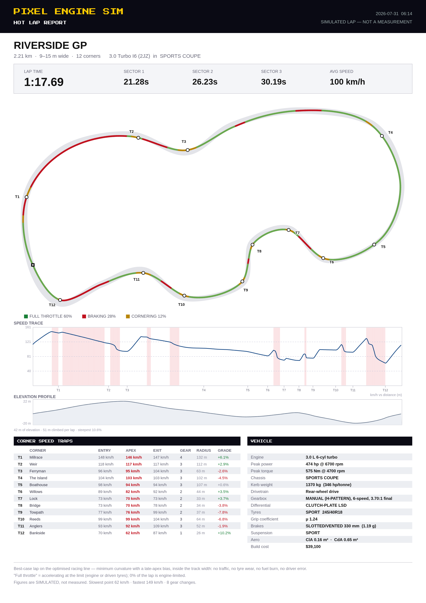
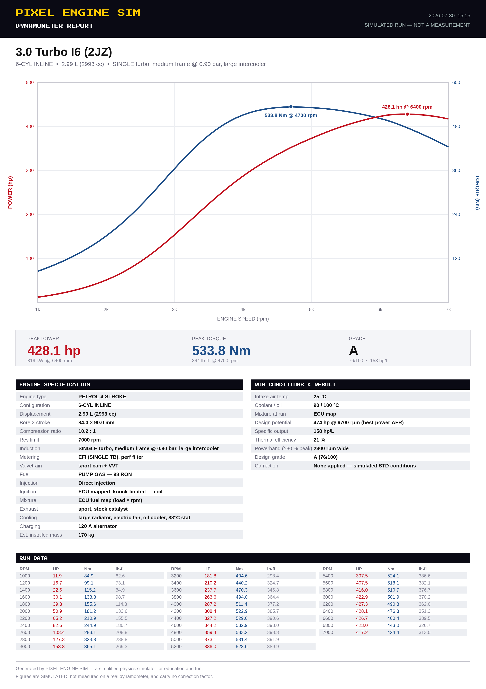
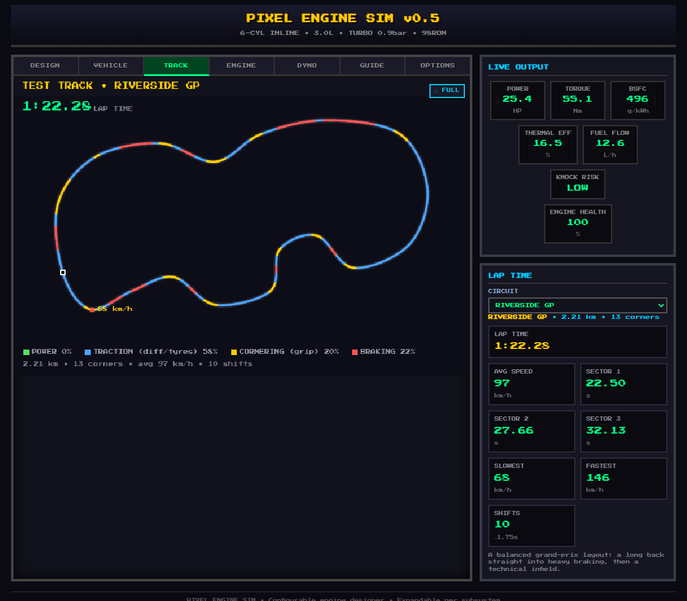
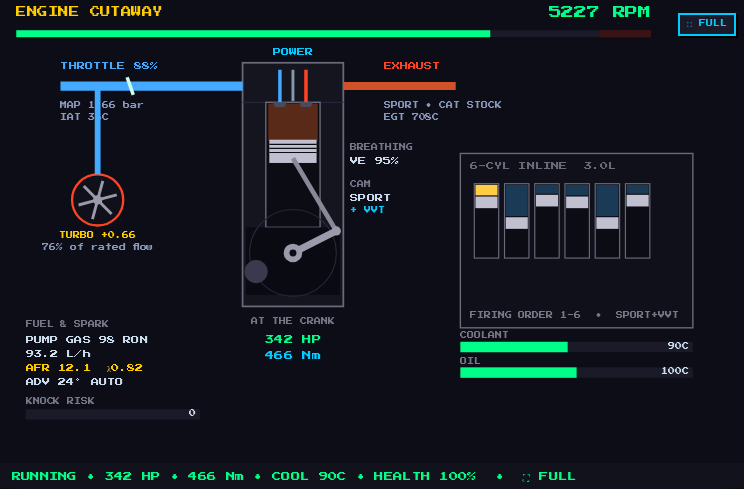
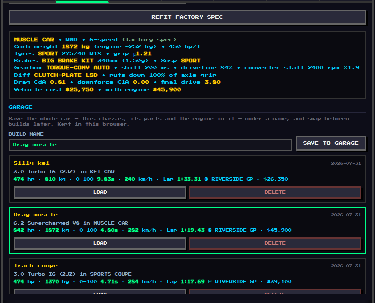
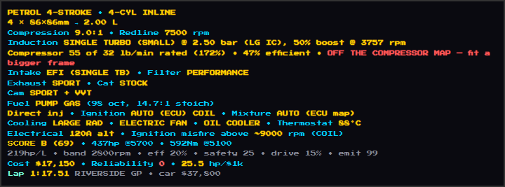

# PIXEL ENGINE SIM v0.6 build 59

**A lightweight, 8-bit style internal combustion engine *designer* & simulator** inspired by *Automation*.

Design an engine from the ground up — cylinders, bore & stroke, compression, forced
induction, exhaust, fuel octane, injection and ignition — then run it on the dyno and
watch the physics respond. Web-based, fully offline-capable, installable as a PWA.


## Features

### Engine Designer (new in v0.3)
Load one of **16 preset builds** from the dropdown — petrol, diesel, rotary and 2-stroke
(1.6 sport, kei turbo, hot-hatch, ITB
screamer, 2JZ six, muscle V8, blown V8, V12 supercar…), or configure your own on the
**DESIGN** tab and press **BUILD & DYNO**. Every parameter feeds the physics:

- **Engine type / cycle** — **petrol 4-stroke**, **diesel (compression-ignition)**,
  **2-stroke**, or **rotary (Wankel)**. Each reshapes the physics: a power stroke every rev
  (2-stroke & rotary) doubles the firing frequency for high specific output; diesel runs lean
  and unthrottled with no spark-knock, big low-end torque and the best efficiency; 2-stroke
  and rotary are thirsty and HC-heavy; rotaries rev sky-high and turbine-smooth. Switching type
  retargets the compression / redline / AFR ranges and disables what doesn't apply.
- **Bottom end** — cylinder count (1–12; rotors 1–3 for rotary), layout (inline / V / boxer),
  bore, stroke, compression ratio, redline. Bore × stroke × cylinders sets the displacement.
- **Air path** — naturally aspirated / turbo / supercharger, boost target, **intercooler size**
  (none / small / large core — a bigger core cools the charge more but adds a little spool lag),
  turbo size, **turbo configuration** (single / twin / sequential / compound), **anti-lag**,
  **supercharger type** (roots / twin-screw / centrifugal), **nitrous** (small / big shot),
  exhaust (stock / sport / race) and a **catalytic converter** (none/decat / sport / stock).
  Twin/sequential/compound turbos spool earlier and flatter; PD superchargers make boost from
  idle while centrifugals build it with rpm²; anti-lag keeps the turbo lit (at a wear cost);
  nitrous is a big power adder from a bottle. A cat cleans the exhaust but adds a little
  back-pressure; deleting it frees a few hp at the cost of emissions.
- **Induction (metering)** — intake system (1/2/4-bbl carburetor, sidedraft carbs,
  mechanical injection, single-throttle EFI, or individual throttle bodies) and air filter
  (open stacks → restrictive). These set top-end breathing, AFR-metering precision (EFI is
  most efficient; carbs waste fuel), throttle response and idle quality.
- **Valvetrain (derived physics)** — cam profile (stock / sport / race), variable valve timing,
  **valves per cylinder** (2 / 4 / 5), **valve material** (steel / titanium) and **valve springs**
  (stock / performance / race). Nothing here is a lookup multiplier: the intake valve diameter your
  bore can physically fit, what that valve weighs, where it **floats**, and how badly the port
  chokes are all derived from geometry and mechanics. Four valves give 22% more intake area than two
  for the same bore, and five give *less than four* — which is why the industry abandoned them. The
  panel shows the **valve float rpm**, and flags it red when it falls below your redline, because
  then the engine cannot use the rev range it claims. A
  wilder cam moves the powerband up and adds top-end at the cost of low-end torque and idle
  quality; VVT recovers the bottom end for a broad powerband.
- **Electrical** — alternator size (60 / 120 / 180 A). With a live **ELEC LOAD** control
  (lights/AC), a small alternator plus heavy load at idle drains the battery — low system
  voltage then weakens the spark. Ignition type sets a dwell/misfire RPM limit (a
  distributor falls off up top; coil-on-plug holds to redline).
- **Fuel & spark** — fuel type (pump gas / race gas / E85 / methanol), fuel octane (RON,
  pump gas only), injector type (port / direct), ignition type (distributor / wasted spark /
  coil-on-plug), **ignition control** (*Fixed* — a locked advance you dial in — or *Auto*, an
  ECU that tracks MBT timing and retards just enough to stay off knock), and the **fuel mixture**:
  *Manual* (one AFR you set everywhere) or *Auto*, a **3D ECU fuel map** that targets near-stoich
  at light load and enriches under load & boost for power/EGT — just like a real fuel map (the
  default on fuel-injected builds; a live **load×RPM heat-grid** shows the target AFR in every
  cell with a marker on the current operating point, and the map is **editable** — tap a cell and
  nudge it richer/leaner to hand-tune the mixture, or reset to the factory grid). Carbs/mechanical
  injection stay manual. Each
  fuel has its own energy density, stoich AFR, knock rating and charge-cooling — alcohols resist
  knock and cool the charge (more power headroom) but burn far more fuel.
- **Cooling** — radiator size (small / stock / large), cooling fan (none / mechanical /
  electric), oil cooler, and thermostat opening temperature.
- **Reliability / wear** — the engine has a live **health** that falls under abuse:
  sustained detonation, overheating, lean-under-boost, and over-rev all wear it (a clean
  tune barely ages). A worn engine makes less power; at zero health it lets go and must be
  rebuilt (BUILD & DYNO or RESET). This puts real stakes on every design and tune choice.

These couple realistically: octane, compression, boost, intake temperature and ignition
advance all feed a **knock model**, and direct injection / higher octane buy back knock
margin so you can run more boost or timing. Get it wrong and the ECU derates power. The
**cooling subsystem** sets running temperatures in Auto Thermal mode — an under-sized
radiator with no fan will heat-soak and overheat under load (and at idle), which in turn
saps power; a large radiator, electric fan and oil cooler keep it cool.


### Simulation & live tuning
- **Live outputs**: Power (HP), Torque (Nm), BMEP, Volumetric Efficiency, Thermal
  Efficiency, BSFC, Fuel Flow, Knock Risk, Engine Health.
- **Seven tabs** — **DESIGN** (build the engine), **VEHICLE** (drop it in a car & read its
  performance), **TRACK** (lap it round a circuit), **ENGINE** (live test-bench schematic),
  **DYNO** (power/torque curve + scorecard), **GUIDE** (an in-app manual) and **OPTIONS** (sound,
  wear and **language**). The right column is context-aware: runtime Engine Controls while
  driving/on the dyno, the live **Performance** panel on VEHICLE and the **Lap Time** panel on
  TRACK.
- **Vehicle & performance (new)** — pick a **chassis** (13 archetypes, each with its own weight,
  size, drivetrain and grip) and it arrives on its **factory spec**: the tyres, wheels, brakes,
  suspension, aero and gearbox that car would really wear, so a kei car turns up on skinny eco
  tyres and small steel discs while a hypercar gets wide semi-slicks, carbon-ceramics and a
  wing/diffuser package. Every part stays editable from there, and **REFIT FACTORY SPEC** puts it
  all back; the summary marks the car *(factory spec)* or *(modified)*. Tune the
  **drivetrain** (FWD/RWD/AWD), the **differential** (open / viscous LSD / clutch-plate LSD /
  spool — how much of the driven axle's grip you can actually put down), the **gearbox** — **type** (manual / sequential / DCT /
  torque-converter auto, each with its own shift time, driveline loss and ratio spacing; the auto
  adds converter stall & torque multiplication off the line), 4–8 speeds, and a
  **final-drive slider**, 4.90:1 short → 2.60:1 tall, with the ratio shown next to the number —
  **tyres** (compound + width/profile/wheel diameter → grip &
  rolling radius), **aero** (front/rear/floor downforce vs drag), **brakes** (type + rotor size →
  stopping power & fade resistance), **suspension** (a grip multiplier) and **weight reduction**.
  Your current engine is dropped in and the sim computes **0–100 km/h**, **400 / 800 / 1000 m**
  (time + trap speed), **top speed**, **100–0 braking** and the **0–200–0** test live — a
  traction-limited launch and a tyre/brake-limited stop (with fade), weight transfer, downforce,
  aero drag and rolling resistance. Vehicle cost and power-to-weight are shown too.
- **Hot lap report (new)** — **LAP REPORT PNG / PDF** on the TRACK tab saves the lap as a printable
  telemetry sheet: the circuit map with **full-throttle** and **braking** sections picked out and
  every corner tagged, a **speed trace** against distance with braking zones shaded, an **elevation
  profile** on the same axis, lap and sector times, the full car specification, and a **speed trap at
  every corner** — entry, apex and exit speed, gear, radius and gradient. Corners are detected from the racing line, numbered T1…Tn and named per
  circuit (Riverside GP runs Millrace, Weir, Ferryman, The Island…). The same corner list drives
  the on-screen corner count, so the app and the sheet can never disagree.

  

- **Dyno report (new)** — **REPORT PNG** / **REPORT PDF** on the dyno save the current pull as a
  printable A4 sheet laid out like a real dynamometer print-out: power and torque traces with the
  peaks called out, a peak-result band, the full engine specification, the conditions the run was
  made under, and a tabulated run-data list. Logged pulls are overlaid faintly for comparison.
  Both formats are generated entirely in the browser — the PDF embeds the rendered sheet as a
  JPEG via PDF's native `DCTDecode` filter, so there is no library and it still works offline.
  The sheet is clearly marked **SIMULATED — NOT A MEASUREMENT**, and prints the *design potential*
  alongside the as-tuned run so the two figures can't be mistaken for each other.

  

- **Test track (new)** — a **TRACK** tab that puts the finished car on a circuit and solves a lap.
  Three layouts with different characters: **Ashdown Park** (2.0 km, tight and technical),
  **Cape Speedway** (3.1 km, long straights and fast sweepers), **Riverside GP** (2.2 km,
  balanced) and the **Nordschleife** (20.4 km, 44 corners, 290 m of elevation and 505 m of climbing
  per lap — geometry and gradients derived from a recorded GPX trace, corners numbered rather than
  named because the detector can't be reliably aligned with the circuit's real corner names). You get a **lap time**, three **sector splits**, average / slowest / fastest speeds
  and the number of gear changes, plus a top-down pixel map — the track drawn to its real, **varying**
  width,
  with an **optimised racing line** through it **coloured by what is limiting the car** — power, traction, cornering grip or braking — and a legend totalling
  how much of the lap each accounts for.

  

- **Animated engine cutaway (new)** — the ENGINE tab is a live section through the engine you
  just designed, and everything on it moves because the simulation moved it:

  

  - **Deliberately not real time.** A crank at 5000 rpm turns 83 times a *second*; drawn
    literally at 60 fps that is a strobe, not a picture. The cycle runs at a readable pace —
    about 3.3 s down to 1.1 s per full four-stroke cycle — still ranked by rpm so idle is
    visibly lazier than the limiter, and it stops dead when the engine does. The true speed is
    on the tachometer and in the note; the animation's job is to make the *cycle* legible.
  - **Proper crank-slider geometry** — `x = r(1−cosθ) + L − √(L²−r²sin²θ)`, not a sine wave. A
    connecting rod of finite length makes the piston linger at the bottom and snap through the
    top; at quarter-crank it is at 0.58 of stroke where a sine would say 0.50.
  - **Drawn to your bore/stroke ratio**, so an oversquare engine really is short and wide.
  - **True four-stroke valve timing** (intake 20° BTDC → 50° ABDC, exhaust 50° BBDC → 10° ATDC)
    with the scavenging overlap visible around TDC. A two-stroke shows ports uncovering in the
    liner instead; a rotary shows a real two-lobe epitrochoid housing,
    `x = R·cosθ + e·cos3θ`, with the rotor turning at a third of the eccentric shaft.
  - The chamber is **colour-coded by what is in it** — fresh charge, compressed, burning, burnt —
    and the stroke is named above the head, so the cycle is watchable rather than memorised.
  - A **bank strip** draws every cylinder at its own phase, so the firing order runs visibly
    through a V12, and the firing cylinder glows.
  - Live parts stay next to the thing they describe: throttle-plate angle at the butterfly, boost
    and compressor flow at the turbo, EGT at the exhaust, and a knock bar.

  The subsystem numbers that used to be printed here in 7 px type live in the **LIVE OUTPUT**
  panel beside the canvas, where they are real text. A **⛶ FULL** button widens the drawing.
- **Canvas rendered at device resolution (new)** — the three visualisations share one canvas that
  drew on a fixed 640×420 backing store while CSS stretched it to whatever the panel was (744 px
  on a desktop, twice that again on a high-DPI screen). Every 7 px glyph landed on fractional
  pixels and smeared. The backing store is now sized to real device pixels and the context scaled,
  so the drawing code keeps its 640×420 coordinates and the output is pixel-exact — which fixes
  **DYNO** and **TRACK** at the same time.
- **In-app GUIDE** — a built-in manual (kept in-app so the offline PWA stays self-contained)
  that explains the loop, the driving controls, every metric on screen and each design
  subsystem, so the numbers are never a mystery.
- **Emissions** — engine-out CO / HC / NOx computed from the mixture (λ) and combustion
  temperature, then cleaned by the catalytic converter *only* in a narrow window around
  stoich: run rich and CO/HC spike (no O₂ to burn them); run lean and NOx slips past (a cat
  can't reduce it with excess O₂). A **DIRTY** analyser is the price of chasing power on a rich
  or decatted tune.
- **WEAR toggle** — turn damage/wear off for free experimentation (invincible engine) or on
  for consequences.
- **Dyno Curve** — full power & torque vs RPM out to your redline, with peak markers and a
  live current-RPM line.
- **Drive it (dynamic model)** — you control **THROTTLE** and **LOAD** (a dyno brake), not
  RPM directly. Opening the throttle raises manifold pressure (MAP), which makes torque,
  which spins the engine up through its **rotating inertia** (derived from displacement &
  stroke, so a big long-stroke engine revs lazily and a small one snaps up). A turbo
  spools as the revs climb; closed throttle gives engine braking; there's an idle floor
  and a rev limiter. No load + throttle = revs to the limiter; add load to hold an RPM.
- **Other runtime controls**: AFR, intake-air / coolant / oil temps.
- **Auto Thermal mode** — coolant & oil drift toward load-dependent targets over time,
  balanced against the cooling subsystem's capacity (radiator airflow scales with RPM;
  the fan provides idle cooling).
- **Engine sound** — Web Audio note pitched to firing frequency (scales with cylinder
  count & RPM) and load, now with a **lope/burble** whose depth tracks the build's character —
  a wild cam, a cross-plane V8 or anti-lag idles lumpy, while VVT and more cylinders smooth
  it out.
- **Scoring** — every build gets a graded scorecard (S–F) rating power, specific output,
  powerband width, efficiency, knock safety, drivability and **emissions**, shown on the
  design summary and the dyno.
- **Strategy / Career** — every build has a **parts cost** and a **reliability index** (a
  design estimate of how much abuse it invites), plus a **power-per-dollar** metric. Pick an
  **OBJECTIVE** on the DESIGN tab (Budget Sleeper, Power per Dollar, Eco Cruiser, Track
  Weapon, Reliability Run, Clean Machine, Specific-Output King…) — some cap your budget — and
  the challenge card ticks off each target live (✓/✗) with a PASS/FAIL verdict, mirrored on
  the dyno. Turns free design into a puzzle with real trade-offs.
- **Dyno pull logging** — snapshot the current curve and overlay several pulls on the graph
  to compare builds or tunes.
- **Garage (new)** — a saved-builds list at the bottom of the **VEHICLE** tab that keeps as
  many finished cars as you like, side by side. Name one and **SAVE TO GARAGE** stores the whole
  thing together — the chassis, every part bolted to it, *and* the engine inside, down to a
  hand-tuned fuel map. Each card carries the headline numbers it had when it was saved (power,
  weight, 0–100, top speed, lap time, total cost), so three builds can be compared without
  rebuilding any of them. **LOAD** restores a car exactly as it was; typing an existing name
  highlights that card and saving overwrites it.

  

- **Save / Load / Share** — quick-save to `localStorage` (a single slot, distinct from the
  garage); **save to a named file** (with a note) and **open** one back; or **Share** a build as
  an encoded link (copied to the clipboard) that loads the exact engine when opened. All four
  paths — quicksave, garage, file and link — carry the *same* `serializeBuild()` record, so a
  build is portable between them and the formats cannot drift apart.
- **Presets**: Optimal / Max Power / Eco / Reset (adapt to the current engine).
- **Languages** — English and **Ελληνικά (Greek)**, switchable in OPTIONS and remembered
  between visits. The whole interface — tabs, labels, buttons, the challenge card and the full
  in-app GUIDE — localises (live technical readouts and units stay universal).
- **Responsive** — a fluid layout that fills the screen in **portrait** (phones & tablets held
  upright) as well as landscape, scaling type and controls up so nothing sits in a narrow strip.
- **Installable PWA**, self-hosted font, works fully offline.


The built-in **GUIDE** tab explains every control and metric without leaving the app:


The interface is fully translatable (English / Ελληνικά) and fills the screen in portrait:


The **VEHICLE** tab drops your engine into a car and computes acceleration & top speed:


## How to Run

### Local
Serve the folder over HTTP and open `index.html`:
```bash
python3 -m http.server 8000    # then visit http://localhost:8000
```
> Opening via `file://` works too, but the PWA/offline features only activate over `http(s)`.

### GitHub Pages
This repo ships `.github/workflows/pages.yml`. Push to `main`, set **Settings → Pages →
Source: GitHub Actions**, and it deploys to
`https://<your-username>.github.io/<repo-name>/`.

## Runtime Controls

| Control          | Range         | Notes |
|------------------|---------------|-------|
| Throttle         | 0 – 100 %     | Opens the flap → MAP → torque → revs |
| Load (dyno brake)| 0 – 100 %     | Resistance that sets steady RPM; 0 = free-rev to limiter |
| Elec load        | 0 – 100 %     | Accessory electrical draw (lights/AC); can drain the battery at idle |
| Air-Fuel Ratio   | rescales/fuel | ~λ0.86 peak power, ~λ1.05 peak efficiency (range set by fuel) |
| Intake Air Temp  | -10 – 60 °C   | Colder = denser charge = more power |
| Coolant Temp     | 40 – 130 °C   | Optimal ~90 °C (auto in Auto Thermal) |
| Oil Temp         | 40 – 150 °C   | Optimal ~100 °C (auto in Auto Thermal) |

RPM and MAP are now **outputs** (shown live under the sliders), not inputs. The **Dyno
Curve** tab remains a wide-open-throttle steady-state sweep for reading the full curve.

## Physics Notes (simplified educational model)

- Engine cycle: the torque equation uses a power-stroke divisor per type — 4π for 4-stroke
  (one power stroke every two revs) and 2π for a 2-stroke and a rotary (a power event every
  rev), which is the main reason those make high specific output. Diesel is compression
  ignition (no spark, no spark-knock; limited by smoke/EGT), runs lean and unthrottled (little
  pumping loss), makes big low-end torque and the highest thermal efficiency; 2-stroke and
  rotary carry a thirst penalty (scavenging / seal losses) and rev high. Emissions follow the
  cycle too (diesel = NOx + soot with DPF/SCR aftertreatment; 2-stroke & rotary = high HC).
- Displacement derived from bore, stroke and cylinder count.
- Dynamic driveline: manifold pressure fills toward a throttle/RPM/boost target; net torque
  (combustion − pumping − friction − brake) accelerates the crank through a rotating inertia
  derived from displacement and stroke. LOAD is a dyno brake that targets a hold-RPM and only
  resists above it (so even a peaky engine can always rev up to it, rather than getting
  trapped below a torque valley); zero load free-revs to the limiter. Lifting the throttle
  gives engine braking, and injection systems cut fuel on overrun (DFCO — zero fuel flow); a
  rev limiter cuts fuel at redline; an idle floor prevents stalling.
- VE uses a broad generalized-bell breathing curve (flat plateau, gentle shoulders) so
  torque stays flat across the midrange and power keeps climbing toward redline instead of
  falling off a peaky Gaussian. Its peak shifts with bore/stroke ratio and redline; exhaust
  choice trades low-end for top-end scavenging.
- Camshaft profile shifts the VE peak and adds top-end breathing/scavenging at the cost of
  low-end VE and idle quality (a wild cam idles high and lumpy). VVT restores most of the
  low end, widening the powerband — strong bottom *and* top.
- Output is calibrated to sane ballpark figures (e.g. a 2.0 L turbo at 0.8 bar / sport
  exhaust / 98 RON makes ~255 hp & ~350 Nm; a 2.0 NA ~130 hp), with only a gentle power
  drop from peak to redline.
- Compression scales indicated work and efficiency via a relative Otto-cycle factor.
- Forced induction raises achievable MAP and heats the charge. Charge heating is the real
  thing — `T·(PR^0.283 − 1) / η_compressor` — not a per-bar constant, so it grows faster than
  boost does and grows again as compressor efficiency falls. The intercooler is rated by
  **heat-exchanger effectiveness** (none 0, small 0.62, large 0.82), the fraction of that rise
  it gives back; a large core leaves the charge coolest but its plumbing volume adds spool lag.
  At 1.8 bar this is the difference between a 164 °C charge with no intercooler (245 hp, knock
  risk 40) and 50 °C with a large one (381 hp, knock 10).
- Turbo boost spools with RPM along a logistic curve: small turbos spool early (strong
  midrange) but choke the top end, large turbos lag down low but flow more up top. Actual
  boost also lags in time (turbo lag), so it builds over ~1 s in the live Engine View.
- **Pressure has to be paid for (new).** A compressor makes boost by spinning, and shaft speed
  has to be bought with exhaust energy — turbine speed for a pressure ratio goes like
  `√(PR^0.283 − 1)`. So the spool point and the response time are functions of *the boost you
  asked for*, not fixed properties of the frame. The same small turbo on a 1.0 L:

  | boost | 50% boost at | time to 90% | charge temp | knock |
  |---|---|---|---|---|
  | 0.5 bar | 1197 rpm | 0.50 s | 33 °C | 0 |
  | 1.0 bar | 1820 rpm | 0.75 s | 40 °C | 3 |
  | 2.5 bar | 2968 rpm | 1.22 s | 58 °C | 34 |

  Previously all three columns were flat — 1820 rpm and 0.75 s at *every* boost target, and a
  small frame delivered 2.28 bar at 3000 rpm on a 2.0 L.
- **Frames have a rated flow (new)** — small 32, medium 55, large 82 lb/min, with config
  multipliers (twin ×1.85, sequential ×1.55, compound ×2.3). That is the axis a real compressor
  map is drawn against. The engine's air demand at peak power is computed against it, and past
  the rating the compressor is off its map: efficiency falls, the top end chokes harder, and the
  charge cooks. A 2.0 L asking 2.5 bar of a small frame wants **166 %** of its rated flow, runs
  49 % efficient, and makes 120 hp *less* than the medium frame while lapping slower than the
  same engine at 0.8 bar. The design summary states the flow, the efficiency and an explicit
  *off the compressor map* warning, so the limit is visible rather than merely felt.

  

  *Known limit: spool lag — the time to build boost — is integrated on the live ENGINE bench,
  but the acceleration and lap solvers work from the steady boost available at each rpm, so
  they feel the spool point move and not the transient. A very laggy build is flattered a
  little by its 0–100 and lap times.*
- Ignition timing has a max-brake-torque (MBT) optimum that varies with RPM and load — too
  little or too much advance loses power, and advancing past MBT feeds knock (retarding pulls
  it back). *Fixed* timing is only optimal at one operating point; *Auto* tracks MBT
  everywhere and retards under knock, so it makes more power across the curve and adapts to
  fuel — full timing on race gas/E85, pulled timing on low octane or high boost.
- Fuel mixture: in *Manual* mode the AFR you set is used everywhere; in *Auto* mode a 3D ECU
  fuel map picks the target AFR from load (MAP) and RPM — near stoich at light load for economy,
  richer under load and boost (down to ~λ0.80) for power and exhaust-temperature control, like a
  real fuel map. Fuel *quantity* is always the air mass ÷ target AFR (so it already responds to
  both load and RPM); the map adds the load-varying target on top. The map is **hand-editable**
  in the design panel — select any load×RPM cell and shift its target richer/leaner (the live dyno
  reflects the change immediately); a custom map is saved with the build and can be reset to the
  factory grid at any time. Scoring and the vehicle acceleration model always evaluate at a fixed
  best-power AFR, so grades and lap-style figures stay comparable regardless of the mode or any
  hand-tuning.
- Intake system sets top-end airflow (restrictive small carbs choke up top; ITBs, sidedraft
  carbs and mechanical injection breathe best) and AFR-metering precision — EFI holds optimal
  AFR for the best efficiency, while carburetors and mechanical injection run richer and
  waste fuel (worse BSFC). The air filter adds an airflow-weighted restriction.
- Knock combines boost, compression, charge/coolant temperature, RPM, timing and mixture,
  offset by fuel octane, charge cooling and direct injection; high knock derates power.
- Emissions: CO rises sharply when rich (incomplete combustion); HC is U-shaped — high rich
  (excess fuel) and very lean (misfire), plus cam-overlap scavenging, imprecise metering and
  a cold engine; NOx is thermal, peaking slightly lean (~λ1.08) and scaling with combustion
  temperature (load, compression, spark advance, hot charge). A three-way cat needs excess O₂
  to oxidise CO/HC but an O₂-free exhaust to reduce NOx, so only a stoich mixture cleans all
  three at once — the rating rewards a cat + precise stoich metering and punishes rich/lean/
  decatted running. The cat also adds a little exhaust back-pressure (a small top-end VE loss).
- Fuel type sets energy density, stoichiometric AFR (the mixture control works in lambda,
  so the AFR slider rescales per fuel), knock rating and evaporative charge cooling. E85 and
  methanol resist knock and cool the intake charge (more power) but need much more fuel
  flow (higher BSFC), while race gas is high-octane pump gas.
- Cooling balances load-generated heat against radiator capacity + airflow (RPM-driven)
  and fan; the thermostat sets the floor temperature. Overheating (>~108 °C) costs power.
- Reliability: engine health accumulates wear from detonation (the big killer), overheat,
  lean-under-boost (burnt pistons) and over-rev; a clean tune barely wears. Lower health
  cuts power; zero health = catastrophic failure until rebuilt. Damage happens over tens of
  seconds of abuse — long enough to heed the warnings and back off.
- Vehicle: acceleration is integrated step-by-step — the engine's best-power torque curve is
  taken through the gearbox (auto-spaced ratios × a final drive from the gearing slider), giving
  tractive force = wheel torque ÷ rolling radius, capped by traction (μ × the driven-axle load,
  including static weight distribution, longitudinal weight transfer under acceleration, and
  aero downforce). Aero drag (½ρ·CdA·v²) and rolling resistance oppose it; the car shifts at the
  limiter, losing drive for the gearbox's shift time. In top gear there is nothing left to shift
  into, so **the rev limiter cuts drive to zero** and drag brings the car back — both the
  standing-start run and the lap solver are bound by the speed the gearing can actually reach,
  never by drag alone. The launch depends on the gearbox. A clutch
  box (manual/sequential/DCT) models a **slipping clutch**: from a standstill the engine is held
  at its launch rpm (≈55 % of the redline) while road speed brings the gearbox input up to meet
  it, and only then locks to the wheels — which is why a peaky, high-revving engine can still
  leave the line hard instead of falling into a torque hole the instant it moves. Slipping never
  adds torque; drive force is still capped by traction, so the launch stays grip-limited. A
  **torque-converter auto** instead stalls its impeller up against a slow turbine and *multiplies*
  engine torque (≈1.9× at a 2400 rpm stall), fading to 1:1 as the turbine catches up. That launch
  advantage is why an auto beats an equivalent manual on a heavy, torquey engine (6.6 diesel
  pickup, 8.61 s → 8.01 s) and loses badly on a light, peaky one whose powerband sits far above
  the stall speed (2.0 ITB screamer roadster, 4.55 s → 5.96 s) — at the cost of the worst
  driveline efficiency of the four boxes.
  The **differential** then sets how much of the driven axle's grip is usable. An axle's two
  wheels are never loaded identically (camber, torque reaction, axle wind-up, suspension
  geometry), and an *open* diff can only feed each wheel what the lighter-loaded one holds — it
  spins that wheel and throws the rest away (≈78 % usable **at launch**). A *viscous* LSD recovers
  most of it (92 %), a *clutch-plate* LSD effectively all of it, a *spool* all of it and a little
  more. That 78 % is **not a constant (new)**: most of the asymmetry an open diff is fighting is
  torque reaction — driveshaft wind-up, anti-lift geometry, torque steer — which is proportional to
  the torque actually going through the axle. In first gear under full multiplication it is at its
  worst; in a tall gear the axle sees a fraction of that torque and little more than road camber is
  left, so an open diff recovers to ≈91 %. Normalised so that at full axle torque it returns
  exactly the quoted figure, which leaves the standing start — and the whole drag-strip diff trade
  — bit-identical. A spool is unaffected, being welded.
  Because it caps traction rather than torque, a diff **only matters while the car is
  traction-limited**: on an 842 hp muscle car, open → spool is worth **0.94 s** to 100 km/h
  (5.52 → 4.58 s), while on a 48 hp kei it is worth **0.05 s** — it never troubles its tyres. Top speed is drag-limited, so the
  diff never changes it.
- **Why a front-driver runs out of grip so early.** Three factors multiply, and the first is the
  one people forget: a FWD car drives only the front axle (≈60 % of the weight standing), and
  accelerating transfers weight *off* it, down to ≈53 %. Times an open diff (0.78) times eco tyres
  (μ 0.81), the whole car is capped at **0.33 g** whatever the engine makes. At 100 km/h that
  ceiling is ~2500 N and even a 109 hp engine already wants 2700 N — so a 217 hp version of the
  same car reaches 100 km/h at essentially the same time. The fix is grip, not power: on that same
  217 hp kei, a clutch LSD alone takes 9.3 s → 7.9 s, sport tyres 6.5 s, slicks 5.5 s, AWD 4.4 s.
- **Acceleration calibration (new).** The whole model is checked against cars whose real 0–100 is
  public, with power, kerb weight, drivetrain, tyre class, diff *and gearbox* all matched first —
  so what is under test is the traction/weight-transfer/gearing model rather than the engine model:

  | car | hp | kg | drive | gearbox | real | model | error |
  |---|---|---|---|---|---|---|---|
  | VW Golf GTI (Mk8) | 245 | 1450 | fwd | DCT | 6.2 s | 6.22 s | +0.3 % |
  | Honda Civic Type R (FL5) | 329 | 1430 | fwd | manual | 5.4 s | 5.19 s | −3.8 % |
  | Toyota Supra RZ (A80) | 326 | 1570 | rwd | manual | 4.9 s | 5.02 s | +2.4 % |
  | BMW M2 (G87) | 460 | 1725 | rwd | auto | 4.1 s | 3.94 s | −3.9 % |
  | Subaru WRX STI (GD) | 280 | 1470 | awd | manual | 5.2 s | 5.06 s | −2.6 % |
  | Suzuki Alto Works | 64 | 720 | fwd | manual | 11.0 s | 11.03 s | +0.3 % |

  RMS error **2.66 %** across the set. Matching the gearbox matters more than it looks — 350 ms of
  manual shift twice is 0.7 s of the run, so quoting a DSG car's time against a modelled manual
  measures the gearbox, not the traction. *(The spool's real penalty is cornering — understeer and tyre scrub —
  which this straight-line sim doesn't model yet, so it looks strictly best; flagged in the GUIDE.)*
  Top speed is the fastest steady speed **any** gear can hold (thrust = drag + rolling
  resistance, capped by the limiter) — a peaky or over-geared car genuinely reaches its maximum
  one gear down, on the cam, rather than bogging in top. The **gearing number is the final
  drive** (0 = 4.90:1, 100 = 2.60:1): short gearing multiplies wheel torque for a quicker 0–100
  but runs each gear out of revs early; tall gearing does the reverse. The optimum is the tallest
  ratio the engine can still pull to its power peak in top gear — past that, top speed stops
  improving (the car just achieves it a gear lower) while acceleration keeps degrading. In the sim
  a 1.5 NA sedan plateaus around 200 km/h at every setting while its 0–100 slides from 10.0 s to
  13.1 s, whereas a twin-turbo V8 supercar keeps gaining, 221 → 407 km/h, all the way to 2.60:1.
  AWD puts all four tyres' grip down and launches hardest;
  FWD loses front load under acceleration. Engine mass is estimated from the spec and added to
  the chassis for curb weight and power-to-weight. Braking is the mirror image: deceleration is
  the lesser of tyre grip (μ·(weight + downforce)) and what the brakes can command (capacity by
  type/rotor size, fading as they absorb heat), with aero drag also slowing the car — so big
  brakes and sticky tyres shorten 100–0, while undersized steel brakes fade in the 0–200–0.
- **Rolling resistance rises with speed.** Hysteresis losses grow with how fast the carcass is
  deformed, so `Crr` climbs roughly with v² — checked against Michelin passenger-tyre data (0.010 at
  80 km/h, 0.013 at 160, 0.016 at 200) rather than against this simulator's own outputs. A fixed
  `Crr` understated resistance by ~60 % at the speeds a fast car actually reaches. It feeds the
  acceleration run, the top-speed scan and the lap solver alike. Each compound also carries the
  **speed rating** it is really sold in (a drag radial rates *below* a touring tyre), shown in the
  VEHICLE panel and flagged when the build out-runs it — but deliberately not used as a hidden
  top-speed cap, because several real cars stop short of their drag-limited speed for a reason
  (a manufacturer governor) that a tyre rating would only imitate.
- **Grip is still a hard clip, and rotational inertia is still free.** Tractive force is capped at
  `μ·N` with no slip, and only the car's translating mass is accelerated. Both are known defects
  with a measured cost — see the inertia investigation in the roadmap.
- Racing line: nobody drives the centreline — using the full width straightens a corner and raises
  the speed you can carry. The line is solved by **minimising total curvature** within the track
  edges (projected gradient on Σ|second difference|², run on a coarse node set because the
  curvature gradient scales like ds⁴/R³ and is hopelessly ill-conditioned at 5 m sampling — worse,
  the Catmull-Rom centreline satisfies the stationarity condition exactly, so a fine-grid solve
  never leaves it). Out-in-out through corners, straightened esses and linked complexes emerge from
  the objective rather than being scripted. It is worth **5–7 % of lap time** over the centreline,
  and the gain scales cleanly with track width (Riverside: 79.7 s at 6 m wide → 75.8 s at 18 m).
- **Late apex (new)**: minimum curvature is symmetric — it prices a metre of radius at corner entry
  exactly like a metre at the exit. On track it isn't: exit speed is carried the whole length of
  whatever follows, while at entry the car is braking anyway. So the curvature cost is **weighted by
  how open the track is ahead** (`Σ w·|Q″|²`, `w = 1 + 3·openness`, 90 m exponential lookahead),
  which makes the solver trade entry radius for exit radius. Both constants are swept against
  measured laps rather than guessed: 3 / 90 m is the setting at which *every* circuit gains — a
  shorter lookahead buys 1.2 s at Ashdown but costs time at Cape and the Ring, which is the model
  over-applying a late apex to a fast sweeper that only wants minimum curvature.

  Measured with a node-quantisation-free metric (arc-length centroid of the line's depth toward the
  inside, minus the centreline's own curvature centroid), the apex moves **+11.7 m later on corners
  that lead onto a straight and only +4.7 m on corners that lead into more corners** — the bias is
  selective, which is the whole claim. Worth 0.15–0.51 % of lap time, and negative on no circuit.

  *Remaining caveat: the bias is priced from the geometry ahead, not from the car's own speed, so a
  90 hp hatchback and an 800 hp aero car drive the same line. It is the same half-percent for
  everyone, so build-to-build comparisons stay honest.*
- **Variable track width (new)**: a circuit is not a constant ribbon — it narrows through the tight
  sections and opens on the fast ones, and a 7 m corner cannot be straightened as much as a 13 m
  one no matter who is driving. Each circuit carries a width profile normalised to **mean 1**, so
  the quoted `width` is by definition the arc-length average and the old width knob still scales the
  whole circuit. Ashdown runs **8–13 m**, Cape **12–16 m**, Riverside **9–15 m**, the Nordschleife
  **8–12 m**. The racing line is clamped per point against its *own* half-width, so it is on the
  track everywhere, not merely within some nominal average. The map is drawn as a filled ribbon
  rather than a fat stroke, because a stroke can only ever be one width.

  For the three hand-built circuits the profile is authored by station. For a GPX import there is
  no survey to read, so it is **derived from the layout** — roads are built wide where they are fast
  and narrow where they are tight — and labelled in the app as modelled, not measured. The
  saturation radius is deliberately high (3 km): a 500 m sweeper through the trees is still a
  country road.
- Imported circuits: **IMPORT GPX TRACK** on the TRACK tab reads a GPX trace and turns it into a
  lappable circuit. Points are projected to metres (equirectangular about the centroid — centimetre
  error at circuit scale), **resampled to a uniform step** because GPX spacing is wildly uneven (a
  real 20 km trace came in at 2.4 m / 27.9 m / 421.8 m min/median/max, which starves the spline in
  places and over-fits it in others), and lightly smoothed so GPS jitter doesn't read as curvature
  and invent corners. Elevation is taken from the file, so an imported circuit gets its real
  gradients; a trace that doesn't quite close is bridged. A 534-point, 20.5 km trace with 290 m of
  elevation imports and solves in ~120 ms. Imported tracks persist in `localStorage` and are marked
  `*` in the list — **nothing is uploaded and no circuit data ships with the app**; importing is
  something the user does with their own file.
  *Accuracy note: imported lap times read a little slow — the line is still an approximation of the
  minimum-time line, the width profile is modelled from the layout rather than surveyed, and the
  driver never errs. It is a consistent yardstick for comparing builds, not a lap record.*
- Elevation: circuits carry a height profile, and the lap is solved in three dimensions. Three
  effects, all of them real: gravity along the slope (`m·g·sinθ`, resisting a climb and adding to a
  descent — and *helping* the brakes uphill, which is why an uphill braking zone lets you brake so
  late); the weight-on-tyres reduced to `m·g·cosθ` on a slope; and **vertical curvature**, where the
  normal load changes by `m·v²·κ_v` — a crest throws the car light exactly where it is fastest, a
  compression presses it down and lets it carry far more speed (on the test circuits, ~104 km/h over
  a brow against ~140 km/h through the equivalent dip). The vertical term is capped at ±0.6 g, since
  real suspension runs out of travel. Validated on a constant-radius circle where elevation can only
  cost time: 22.55 s flat → 22.74 / 23.21 / 25.31 / 28.32 s as the profile grows, with minimum speed
  falling and maximum rising throughout. Where the hills sit matters as much as their size — rotating
  the same profile around a circuit swings the lap by ±3.8 s.
- Lap time: a quasi-steady-state solver over that racing line. Each circuit is a ring of
  control points; a closed Catmull-Rom spline through them gives a smooth, guaranteed-closed
  centreline whose sampled curvature feeds the physics **and** whose polyline draws the map, so the
  picture can never disagree with the numbers. The solver takes the cornering ceiling at every
  point — *m·v²/r = μ·(m·g + ½ρ·ClA·v²)*, which solves for v² in closed form because downforce
  scales with v² too — then runs a **backward braking pass** and a **forward traction/power pass**,
  keeping the lower speed at each point. A **friction circle** couples them: grip already spent
  turning is unavailable for accelerating or braking, so a car at the cornering limit cannot also
  deploy its power. Gearbox shift time is charged per gear change around the lap. The result is
  that circuits reward different builds — a 300 hp/1049 kg screamer beats an 842 hp/1872 kg
  muscle car around Ashdown (92.3 s vs 95.3 s) and loses to it down Cape's straights
  (85.5 s vs 84.0 s).
- Differential on track: the straight-line traction figure is only the standing case. Cornering
  transfers load off the inside wheel, so an open diff — governed by the lighter-loaded wheel —
  collapses exactly when you want power on exit, while a locked one is unaffected. That, plus the
  lateral grip a locked diff scrubs away, finally prices the spool honestly: on an 842 hp muscle
  car it is ~0.2 s **quicker** to 100 km/h than a clutch LSD and ~2.9 s **slower** around Ashdown,
  and an open diff is worst at both ends.
- Track objectives: four of the challenges set a **lap target on a named circuit** rather than an
  engine metric, and their budget covers **engine + vehicle**, so the whole car is being judged.
  Targets are calibrated against measured builds — each is reachable with about 1–7 s of margin by a
  sensible build and comfortably missed by a weak one (a 112 hp kei car fails all four). Lap time is
  also **reported on the scorecard**, but deliberately *not* folded into the letter grade: the grade
  rates the engine, and an engine's grade should not move because the tyres changed. Verified — the
  same engine holds A(76) whether it is in a kei body or a hypercar, while its Riverside lap moves
  93.2 s → 53.7 s. Lap results are cached on the engine+vehicle build (cold 6.9 ms, cached
  0.0004 ms/call), since the dyno scorecard redraws sixty times a second.
- Strategy: each part carries a rough build cost, summed into a total (so budget challenges
  and power-per-dollar have meaning); a design reliability index estimates durability from
  knock margin, boost/specific-output stress, high-strung choices (anti-lag, nitrous, sky-high
  redline) and cooling adequacy for the power made. These are design-time estimates, not the
  live wear model (which still plays out as you drive).
- Electrical: the alternator (output rising with RPM) charges the battery when it
  out-supplies demand and drains it otherwise; system voltage tracks state of charge. Low
  voltage weakens the spark, and each ignition type has a dwell/misfire RPM limit, so a
  distributor or a flat battery loses top-end power. The alternator also costs a little
  parasitic crank power, most noticeable at idle.
- Standard 4-stroke BMEP → Torque → Power conversion throughout.

Numbers are calibrated to a realistic ballpark but this is not a high-fidelity thermodynamic
model — it's tuned for fun, learning and rapid experimentation (the "light Automation"
philosophy).

## Project Structure

```
.
├── index.html                     # Complete single-file app (HTML + CSS + JS)
├── CHANGELOG.md                   # Release history; every commit carries a build number
├── favicon.svg / manifest.webmanifest / sw.js   # PWA (icon, manifest, offline SW)
├── assets/                        # Self-hosted font + PWA icons
├── docs/                          # README screenshots
├── tests/                         # Headless Playwright suite — see tests/README.md
│   ├── run.mjs                    #   node tests/run.mjs   (reports by exit code)
│   └── proto/                     #   parked models, not run by the suite — see tests/proto/README.md
├── tools/stamp.mjs                # Stamps + verifies the build number
└── .github/workflows/pages.yml    # Auto-deploy to GitHub Pages
```

**One file, on purpose.** `index.html` opens straight from `file://` with no server, no build step
and no dependencies, works offline, and is a single artefact to share or archive. Splitting it into
modules would cost all of that — ES modules are blocked from `file://` — so the seam is marked
inside the file rather than cut. Worth revisiting past ~600 KB.

**Versioning.** `MAJOR.MINOR` plus a unique build number per commit — a counter in the file that
only ever increases, so it survives squash-merging (a commit *count* does not: squashing three
commits into one makes it go backwards):

```sh
node tools/stamp.mjs            # bump the build number in index.html and README
node tools/stamp.mjs --check    # verify it is consistent and ahead of origin/main
```

## Roadmap / Future Expansion

### The original feature plan — all shipped

1. ~~Engine presets / example gallery~~ ✅ — a **LOAD A PRESET** dropdown with popular
   archetypes (1.6 sport, kei turbo, hot-hatch, ITB screamer, RS5-turbo, 2JZ six, muscle V8,
   blown V8, V12 supercar, eco turbo, diesels, rotaries, two-stroke).
2. ~~**(D) Forced-induction & tuning depth**~~ ✅ — turbo configs (twin/sequential/compound),
   supercharger types (roots/screw/centrifugal), anti-lag, nitrous, an **editable 3D ECU fuel
   map** (tap a load×rpm cell, − LEAN / + RICH, RESET MAP), and pressure-ratio-aware spool with
   compressor flow limits. *Ignition is covered by the Auto (MBT-tracking, knock-limited) timing
   model rather than a hand-editable spark map — see below.*
3. ~~**(E) Emissions & sound**~~ ✅ — engine-out CO / HC / NOx vs mixture & combustion
   temperature, a **catalytic converter** with a stoich-window three-way conversion model, a live
   analyser readout, an emissions score, and a character-driven **lope/burble** on the note.
4. ~~**(C) Strategy layer**~~ ✅ — per-part costs, build budgets, a design reliability index and
   power-per-dollar, plus objective-based challenges with live pass/fail — including four that
   judge the **whole car against the clock** on a circuit.
5. ~~**(B) New engine types**~~ ✅ — diesel (compression ignition), rotary/Wankel and 2-stroke,
   each with its own firing frequency, fuelling, efficiency, emissions and sound.
6. ~~**(A) Vehicle / drivetrain layer**~~ ✅ — chassis, drivetrain, gearbox types, differential
   types, tyres, aero, weight, brakes and suspension → acceleration, top speed, braking and the
   0–200–0 test, with **per-chassis factory fitment**; a **test track** (four circuits, a
   friction-circle lap solver with a late-apex racing line, variable width and 3D elevation,
   sector splits and a limit-coloured map); lap time feeding the **challenge system and
   scorecard**; and a **garage** holding any number of named chassis+engine combos.

### Known limits — the honest list

These are modelled approximations that are *stated* rather than hidden, each one measured and
documented in the GUIDE at the point where it matters:

- **Turbo lag doesn't reach the performance numbers.** Spool time is integrated on the live
  ENGINE bench, but `simulateAccel` and `simulateLap` both work from the steady boost available
  at each rpm, so they feel the spool *point* move and not the transient. A very laggy build is
  flattered a little by its 0–100 and lap times.
- **The racing line doesn't know what car is driving it.** The late-apex bias is priced from the
  geometry ahead, not the car's own speed, so a 90 hp hatchback and an 800 hp aero car take the
  same line. It is the same half-percent for everyone, so build-to-build comparisons stay honest.
- **A lap is a single best-case lap** — no tyre wear, no fuel burn, no traffic, no driver error.
- **Imported circuits have modelled width, not surveyed width**, derived from the layout.
- **There is no engine braking above the limiter.** Past the rev limiter drive force is zero, but
  nothing pushes back, so a steep descent can carry a car a km/h or so beyond the speed its top
  gear allows. Real overrun would drag it back.
- **Power peaks at the rev limiter on one preset** (2.0 Turbo Hot-Hatch) — down from four before the
  valvetrain conversion and two before gas dynamics. Every naturally-aspirated preset now rolls off
  inside its own rev range for a stated reason. The one that remains is a *turbo*, and what sets a
  turbo's peak position is boost taper as the compressor runs out of map — turbo-map physics, which
  is conversion 4. `tests/test46.mjs` holds this at a budget of 1 and additionally fails outright if
  any NA preset ever joins it.
- **Two behavioural tests fail.** `test40` asserts an over-flowed turbo frame should be penalised on
  a lap — a small frame 159% over its rated flow at 2.5 bar currently is not, which is turbo-map
  physics and therefore conversion 4. `test38` asserts the late-apex racing line never costs time;
  on the *fast* circuit it now costs 0.24 s while gaining 0.39–0.99 s on the other three. That is a
  finding about the racing line rather than about the engine: the late-apex bias is not universally
  beneficial and wants a per-corner decision instead of a blanket shift.
- **`vePeakRpm` is still asserted, and removing it has now failed twice.** Deriving it from Taylor's
  Mach knee put every engine's peak at 0.92–0.97 of redline (54% RMS). Replacing the bell entirely
  with a flat port-flow envelope gave 10.89% RMS. The second attempt is the more informative one: it
  exposed two missing mechanisms — low-rpm charge short-circuiting through a big overlap, and
  whatever caps peak VE below the 1.2 clamp that the ITB screamer now pins against above 7500 rpm.
  The no-bell thesis still looks right, but those two have to exist first.
- **Rotational inertia is not charged during acceleration.** The engine, flywheel, gearbox and
  wheels all have to be spun up as well as the car pushed along, and reflected through first gear
  that is worth roughly +13 % of effective mass. `simulateAccel` accelerates the translating mass
  only. Every car is therefore flattered by about 6 % on 0–100, and the 2.66 % calibration below was
  reached with that gift in place — see *The inertia investigation* under the v1.0 plan.

### Next: v1.0 — every number derived, not fitted

This is the current direction, and it is a change of principle rather than a feature list.

Parts of the model reach their accuracy through **lumped coefficients that were tuned until the
outputs matched reality** — `CAM{peakShift, ampMul, scav}`, `EXHAUST{topGain, lowLoss}`,
`TURBO{spool, choke, k, flow}`, `IMEP_K`, `DIFF_ASYM0`, `KVCAP`. They work, and they are honest
approximations, but they are fitted rather than derived: they encode *the answer* instead of the
mechanism that produces it.

v1.0 replaces them component by component with quantities derived from geometry and physical law,
and **accepts whatever accuracy that produces** rather than tuning back toward a target. A
first-principles model will very likely score worse at first — the present 2.66% RMS exists partly
*because* coefficients were fitted to produce it. The rule is that any regression must be
explainable, traceable to a component not yet modelled, and every component added must improve the
score.

Planned order, each validated against `tests/test41.mjs`, `tests/aero.mjs` and `tests/test43.mjs`:

1. ~~**Valvetrain and port flow**~~ ✅ — valve area and count, spring rate and valve mass, cam lift
   and duration; port choking from Taylor's inlet Mach index, valve float from the inertia/spring
   balance. Presets peaking at the exact rev limiter went **4 → 2**, and the two that were fixed are
   both big-bore two-valve engines that now roll off for a stated reason. Calibration unchanged at
   2.66% RMS. The two that remain are four-valve high-revvers that are genuinely neither choked nor
   float-limited — their peak is set by intake wave tuning, which is step 3.
2. **Tyre** — ◐ *partly done.* ✅ Speed-dependent rolling resistance (top-speed RMS against real
   cars 9.3% → 6.5%) and a tyre speed rating you choose, shown and flagged when exceeded but
   deliberately *not* used to cap top speed. ⬜ **Parked:** the slip-ratio curve in place of the hard
   `min(driveF, μ·N)` grip clip. It was built and it works; wiring it in exposed a *different*
   missing physics — rotational inertia — and the two have to be fixed together. Written up below.
3. **Gas dynamics** — ◐ *first round done.* ✅ Intake ram as a **Helmholtz resonance** (runner as
   neck, cylinder as volume — the textbook treatment), exhaust scavenging as a **reflection comb**
   whose rarefaction must arrive during overlap, back-pressure from Darcy-Weisbach through a system
   pipe sized off the engine's own flow, overlap derived from duration and LSA, late-IVC trapping,
   and exhaust gas temperature from the energy balance. **Five fitted numbers retired:**
   `CAM{peakShift, scav, lowLoss}` and `EXHAUST{topGain, lowLoss}`. New input: intake runner length,
   including VARIABLE — a variable-length manifold is two lengths and a flap, which is all a DISA or
   a VarioRam is. **Presets peaking at the exact rev limiter: 2 → 0**, which is what this conversion
   existed to fix. ⬜ Two behavioural tests still disagree with the derived curve shape and are left
   failing rather than weakened; `vePeakRpm` is still asserted. Details below.
   Exhaust was folded in here rather than being its own step, and that turned out to be the whole
   game: `EXHAUST.topGain` and `CAM.scav` really are two knobs for one event, and deriving either
   alone would have left the other double-counting it.
4. **Turbo** — compressor and turbine maps instead of the lumped `{spool, choke, k, flow}` table.
5. **Combustion** — a real cycle with heat release, replacing `IMEP_K` and friends. Biggest prize,
   biggest risk, so it goes last.

#### The inertia investigation — what happened when the slip model was wired in

This is recorded in full, failures included, because the *result* is a defect found in the shipped
model and the *method* is the decision rule this whole rewrite runs on.

**The model.** Slip ratio `s = (ωr − v)/v` becomes a state variable, and grip follows a Pacejka-lite
curve `μ = μ_peak · sin(C · atan(B·s))` with `B = tan(π/2C)/s_opt` placing the peak exactly at the
compound's `s_opt` and `C = 1.4` giving a full-slide plateau at 0.81 of peak (measured tyres: 0.75–0.85).
The driven wheels get their own equation of motion, `I_eff · dω/dt = T_axle − F·r`, with
`I_eff = I_wheels + I_engine · ratio²`. Prototyped standalone in `slip.mjs` first, because the slip
dynamics are far stiffer than the vehicle dynamics: it converges at the app's existing `dt = 0.005 s`,
and it makes short gearing genuinely cost time on a powerful car — which the hard clip could never do,
since a clipped launch is identical at every final drive.

**And it made the calibration worse.** Real-car 0–100 RMS went **2.66 % → 7.79 %**, past the suite's
5 % threshold. Every car came out *slow*, mean bias **+5.7 %**.

Under the rule stated above that is not automatically a rejection — a regression is allowed if it is
explainable and traceable to something not yet modelled. So the point was to find out which.

| experiment | RMS | mean bias | what it says |
|---|---|---|---|
| shipped model (hard clip, no rotational inertia) | 2.66 % | — | the baseline being defended |
| slip curve + `I_eng` 0.15, wheels full | 7.78 % | +6.10 % | the regression |
| slip curve + `I_eng` 0.15, wheel inertia ×0.65 | 7.22 % | +5.66 % | wheels are not the driver |
| slip curve + `I_eng` **0.00** | 5.37 % | +4.34 % | slip alone still costs 2.7 pp |
| hard clip + rotational inertia as effective mass | 16.27 % | — | inertia alone is far worse |

That last pair is the useful one, and it corrected a conclusion I had drawn too early. Inertia
*alone* costs 16.27 %, inertia *plus* slip costs 7.78 % — so slip is recovering about half of it, and
it is tempting to call the slip model sound and blame inertia entirely. Setting `I_eng` to literally
zero kills that: the slip model on its own still gives **5.37 %** against the baseline's 2.66 %. The
regression splits roughly in half — **≈2.7 pp from the slip dynamics themselves, ≈2.4 pp from engine
inertia**. Both are real, and neither excuses the other.

**Three hypotheses for the residual, all eliminated.**

- **Driveline efficiency.** If the cars are slow because too much torque is being lost, `driveEff`
  should be too pessimistic. Getting the bias to zero needs **0.972** for an RWD manual; real
  measured driveline efficiency is 0.88–0.93. Rejected — it would be a fitted coefficient wearing a
  physical name, which is exactly what v1.0 exists to remove.
- **Engine inertia magnitude.** Perhaps `I_engine` is simply too large. Zeroing the bias needs
  **≈0.03 kg·m²**; a real four-cylinder crank, flywheel and clutch pack is **0.10–0.20 kg·m²**.
  Rejected for the same reason.
- **Tyre grip.** The obvious remaining candidate: the μ curve is too stingy. It is **backwards** —
  reducing grip made things monotonically worse (μ ×1.00 → 7.22 %, ×0.94 → 9.08 %, ×0.85 → 14.10 %)
  because the cars are already too slow, not too fast. Rejected, and it was a useful correction to
  a prediction I had made with some confidence in the wrong direction.

**The signal that survives.** The AWD Subaru WRX sits at **+5.9 %** and barely moves — +5.9, +5.9,
+6.1 — across a 15 % swing in grip. Whatever is slowing it down is not traction, because a
four-wheel-drive car on that much grip is not traction-limited at all. Work out the reflected
inertia instead: `I_eng × ratio²` in first is ≈21.6 kg·m², which over `r²` is ≈190 kg of apparent
mass on a 1470 kg car — **+13 % effective mass in first gear, ≈+5 % on the 0–100 run.** That is the
+5.9 % almost exactly.

**So the inertia term is not wrong. The old model was giving every car a free ~6 % by never charging
rotational inertia at all**, and the 2.66 % calibration was reached with that discount baked in. Two
compensating errors read as accuracy: no inertia (too fast) against a hard grip clip that lets a car
put down its full torque from a standstill (also too fast) against real cars that do neither.
Removing one without the other is what produced the regression.

**Not shipped.** Both halves were reverted; `main` carries neither. The standalone model is kept at
**`tests/proto/slip.mjs`** — it runs on its own with `node`, and it is the spec to build from when
the work resumes rather than something to reconstruct from this write-up. The browser harnesses that
produced the sweep tables are *not* kept: they patched copies of `index.html` on a scratch disk and
hard-coded absolute paths to them.

The fix is not a coefficient, it is the **launch model**: the current clutch holds the engine at a
fixed launch rpm and hands the wheels whatever torque grip allows, which is a kinematic assertion,
not a mechanism. It should be a **torque-capacity limit** — the clutch transmits what its clamp load
and friction radius can carry, the engine accelerates on the difference, and slip ends when the
speeds meet. With that in place the slip curve and the inertia term can go in together and the whole
set be recalibrated once. That is the next piece of step 2.

**Two test failures worth remembering, both the same mistake.** Twice a sweep was set up by
monkey-patching a value that is a `const` at script scope — first `crrAt` while proving `Crr(v)`
reaches the solver, then `I_ENGINE` in the first inertia sweep. Neither patch does anything, and the
second one silently produced *identical* numbers for `I` = 0.15, 0.10 and 0.06, which I read as
"inertia is not the driver" and reported as such before catching it. Patch the **use site**, never
the declaration; and a sweep whose rows do not differ is a broken harness, not a null result.

**Deferred behind this:** **rim material and weight.** It is genuinely relevant once inertia counts —
unsprung rotating mass is charged twice, once translating and once spinning, so forged vs cast is
worth 1–2 % on 0–100. Adding it while the inertia term itself is still being reworked would just
make the rework harder to read.

Also queued: a **UI redesign** for the DESIGN and VEHICLE tabs, which are already crowded and will
get more so as derived physics adds inputs. Progressive disclosure — headline inputs by default, a
detail expander per subsystem — after the first conversion lands, when the final input set is known.

Greek translation is **paused** for the duration. New strings are still wrapped in `tr()`, and the
untranslated backlog is counted and printed on every test run rather than hidden.
- **Charge the acceleration and lap solvers for spool lag**, closing the first limit above. It
  needs a transient pass rather than the current per-rpm steady solve.
- **A hand-editable ignition map**, to match the fuel map editor — the last piece of item 2.
- **Tyre wear and fuel burn over a stint**, turning the single best-case lap into a run.
- **V/boxer geometry in the large cutaway.** The bank strip already lays cylinders out by layout
  (a V12 shows two banks of six, a boxer two opposed pairs), but the big section is still a single
  upright cylinder whatever the layout — a real V-angle or opposed section would finish it.
- **Native Android wrap** (Capacitor/TWA) — parked, not abandoned.

### Completed

- [x] Configurable engine designer (cylinders, bore/stroke, compression, induction, fuel, spark)
- [x] Dynamic throttle + load driveline with rotating inertia (drive it, don't set RPM)
- [x] Full dyno sweep graphs (power & torque curves)
- [x] Dynamic thermal model (temps change over time)
- [x] Forced induction (turbo / supercharger, boost, intercooler)
- [x] Sound (Web Audio API engine note)
- [x] Pressure-ratio-aware turbo spool, compressor flow limits and real charge heating
- [x] Torque-scaled axle asymmetry, and acceleration calibrated against six real cars
- [x] Animated engine cutaway at a readable pace, with live values beside each part, at device resolution
- [x] Save / load engine setups
- [x] Garage: any number of named chassis+engine combos, with per-build stat cards
- [x] Mobile app packaging (PWA)
- [x] Firing-order animation and V / boxer bank layout in the cutaway's cylinder strip
- [ ] V-angle / opposed geometry in the *large* cutaway section (still one upright cylinder)
- [x] Cam profiles & valvetrain (stock/sport/race cam + VVT, reshaping the VE curve & idle)
- [x] Turbo lag / spool modelling vs. RPM (turbo size, spool curve, transient lag)
- [x] Cooling subsystem (radiator size, fan, oil cooler, thermostat) feeding the thermal model
- [x] Electrical subsystem (alternator, battery/charging, dwell-limited ignition misfire)
- [x] Different fuels (pump/race gas, E85, methanol) with their own energy, stoich, knock & cooling
- [x] Induction/metering systems (carbs, mechanical injection, EFI, ITBs) + air filters
- [x] Ignition control: Fixed vs Auto (ECU, MBT-tracking & knock-limited timing)
- [x] Fuel mixture: Manual (fixed AFR) vs Auto (editable 3D ECU fuel map, load×RPM, with a live heat-grid)
- [x] Reliability / wear simulation (health falls under detonation/overheat/lean-boost/over-rev)
- [x] Scoring / rating (graded scorecard) and dyno-pull logging & overlay
- [x] Save to / open from named files (with notes) and shareable build links
- [x] Emissions (engine-out CO/HC/NOx + three-way catalytic converter) with a live analyser & score
- [x] Character-driven engine note (lope/burble from cam, layout & anti-lag)
- [x] Intercooler core sizing (none/small/large — charge cooling vs spool lag)
- [x] In-app GUIDE tab (documentation) and OPTIONS tab (sound/wear/language); tab-aware side panel
- [x] Vehicle Designer placeholder reserving space for the vehicle/drivetrain layer (feature A)
- [x] Strategy layer: parts cost/budget, reliability index, power-per-dollar & objective challenges
- [x] New engine types: diesel (CI), 2-stroke and rotary/Wankel, each with distinct physics & emissions
- [x] Localisation (English / Greek) with persistence, and a responsive portrait layout
- [x] Vehicle layer: chassis/drivetrain/gearbox/tyres/aero/weight/brakes/suspension → 0–100, 400/800/1000 m, top speed, 100–0 & 0–200–0
- [x] Per-chassis factory fitment (matching tyres/wheels/brakes/suspension/aero) + a final-drive read-out on the gearing slider
- [x] Gearbox types: manual / sequential / DCT / torque-converter auto (shift time, driveline loss, ratio spread, converter stall & multiplication)
- [x] Differential types: open / viscous LSD / clutch-plate LSD / spool, capping the usable share of driven-axle grip
- [x] Test track: 3 circuits, quasi-steady-state lap solver with a friction circle, sector splits and a limit-coloured pixel map
- [x] Minimum-curvature racing line within the track width (5–7 % quicker than the centreline)
- [x] Late-apex bias on corners that lead onto a straight (+11.7 m of apex shift, selective)
- [x] Variable track width per circuit, authored or derived, with a per-point line clamp
- [x] Track elevation: gradient, slope-adjusted load and crest/compression vertical curvature, with an elevation profile on the lap report
- [x] GPX circuit import (projection, uniform resampling, smoothing, real elevation) with localStorage persistence
- [x] Nordschleife in the track pack (20.4 km, 290 m elevation) — a real road course as a benchmark
- [x] Track objectives (lap targets on named circuits, budgeting the whole car) + lap time on the scorecard
- [x] Printable dyno report (PNG + library-free PDF) with chart, peaks, engine spec, run conditions and tabulated data
- [x] Printable hot lap report: map with throttle/braking highlighted, speed trace, sector times, per-corner speed traps with names
- [x] Calibration pass for realistic power figures & curve shape (ongoing refinement)
- [ ] Native Android build (wrap the PWA with Capacitor or a Trusted Web Activity)

> **Android note:** the app is intentionally a self-contained, offline-capable PWA with no
> server or external network dependencies and all persistence in `localStorage`. That keeps
> it wrappable into an Android APK later (Capacitor or a Trusted Web Activity) with minimal
> changes. New features are kept touch-friendly and framework-free to preserve that path.

## License

MIT – free to use, modify, and share. Credit appreciated but not required. See [LICENSE](LICENSE).

---

**PIXEL ENGINE SIM** – Built for tinkerers who love engines and pixel art.
